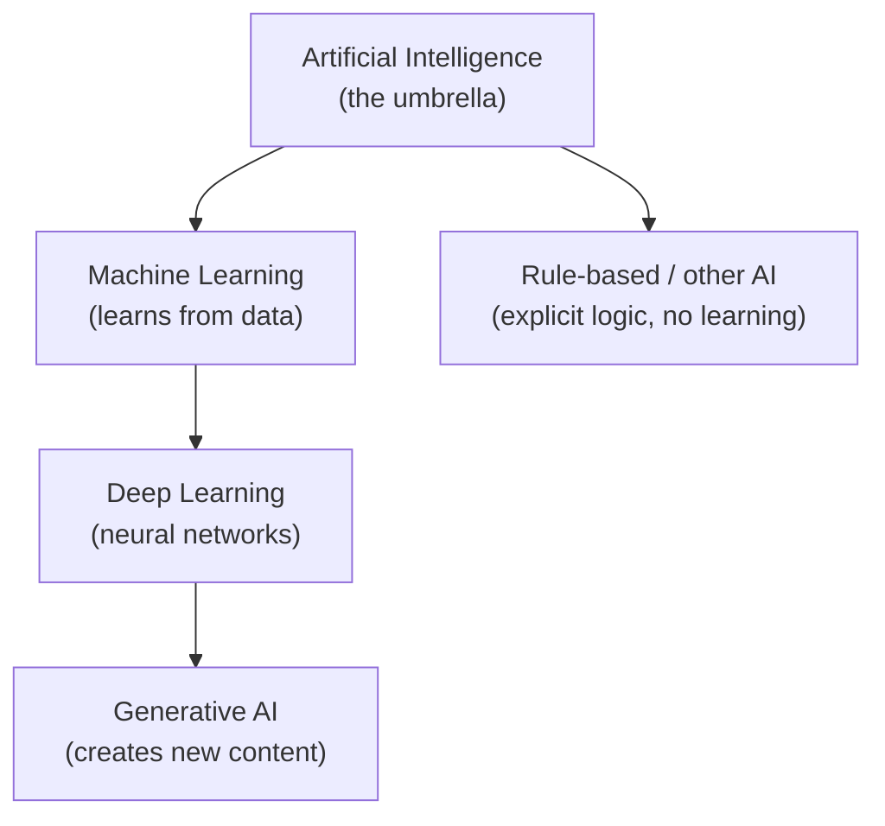
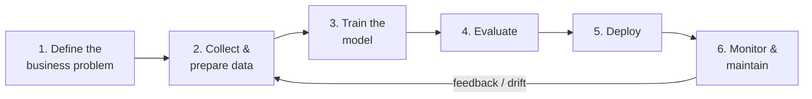

<!-- markdownlint-disable MD041 -->
# Chapter 1 — Understanding Generative AI

*Part I — Generative AI & Responsible AI foundations*

---

## In 30 seconds

- **The core idea**: generative AI is a class of machine learning that *creates* new content — text,
  images, code, audio — by predicting the most likely next piece of a sequence, one token at a time.
- **Why it matters**: everything else in this book (Copilot, agents, Foundry, adoption strategy) sits on
  top of this idea. Both exams assume you can reason about what generative AI is, when it adds value, and
  how it fails.
- **The exam angle**: expect questions on generative vs other AI, pretrained vs fine-tuned models, tokens
  and cost/ROI, the challenges (fabrications, reliability, bias), and the machine-learning lifecycle.
- **Remember**: generative AI is *probabilistic*, not deterministic. It predicts plausible output — which is
  exactly why it is powerful *and* why it can be confidently wrong.

---

## Exam map

**Exam map — AB-731 · Domain 1: Identify the business value of generative AI solutions (foundational concepts) · AB-730 · Domain 1: Understand generative AI fundamentals**

---

## 1. Key concepts

### From "AI" to "generative AI"

"AI" is an umbrella term. Underneath it sits **machine learning (ML)** — systems that learn patterns from
data rather than following hand-written rules — and underneath ML sits **generative AI**. Getting these
nested relationships straight is the foundation for every capability question on both exams.

> 📖 **Definition — Artificial intelligence (AI)**: software that performs tasks normally associated with
> human intelligence, such as recognizing images, understanding language, or making recommendations.

> 📖 **Definition — Machine learning (ML)**: the branch of AI where a model *learns* patterns from example
> data instead of being explicitly programmed with rules.

> 📖 **Definition — Generative AI**: a category of machine learning that generates *new* original
> content — natural language, images, code, audio, or video — in response to a prompt.

A useful way to hold it in your head:

### Generative vs other kinds of AI

The distinction the exams care about is **what the model produces**:

| Type of AI | What it does | Typical output | Example |
| --- | --- | --- | --- |
| **Generative AI** | Creates new content | An email draft, an image, code | "Write a summary of this report" |
| **Predictive / discriminative ML** | Classifies or forecasts | A label, a number, a probability | "Is this transaction fraud?" |
| **Computer vision** | Interprets images | Detected objects, extracted text | "Read the text on this receipt" |
| **Natural language processing (NLP)** | Extracts meaning from text | Sentiment, entities, key phrases | "Is this review positive?" |
| **Rule-based systems** | Applies fixed logic | A deterministic decision | "If order > $1,000, flag it" |

> 📌 **Key concept**: predictive models tell you *which category* or *what value*; generative models produce
> *new artifacts*. When a business need is "create/draft/summarize," think generative AI. When it is
> "classify/score/forecast," think traditional ML.

### How large language models generate text

Generative AI for text is powered by **large language models (LLMs)**. An LLM is trained on very large
amounts of text and learns the statistical relationships between words. It does not "look up" answers; it
**predicts the next token** given everything before it, then repeats — token after token — until the
response is complete.

> 📖 **Definition — Token**: the unit an LLM reads and generates. A token is a chunk of text — roughly ¾ of
> a word in English (a common rule of thumb is ~4 characters per token). "Understanding" might be one token;
> an unusual word may split into several.

> 📖 **Definition — Prompt**: the input (instruction, question, and any supplied context) you give the model
> to steer its output.

Because generation is probabilistic, the same prompt can produce slightly different answers, and the model
optimizes for *plausible* text — not verified truth. This single fact explains most of the challenges later
in the chapter.

### Pretrained vs fine-tuned models

Two model terms appear repeatedly on AB-731:

> 📖 **Definition — Pretrained model**: a model already trained on a broad, general-purpose dataset. It
> works "out of the box" for a wide range of tasks. Microsoft 365 Copilot uses large pretrained models.

> 📖 **Definition — Fine-tuned model**: a pretrained model further trained on a smaller, domain-specific
> dataset so it performs better on a specialized task (for example, a model tuned on legal contracts).

| | Pretrained | Fine-tuned |
| --- | --- | --- |
| Training data | Broad, general | Additional narrow, domain-specific |
| Effort/cost to adopt | Low — use as-is | Higher — needs curated data and training |
| Best when | The task is general | You need consistent, specialized behavior |

> 🎯 **Exam tip**: fine-tuning is **not** the first tool you reach for. For most business needs, a
> pretrained model plus **good prompting** and **grounding** (giving the model your data at query time —
> see Chapter 2) is cheaper and faster than fine-tuning. Fine-tuning is justified when you need repeatable,
> specialized behavior that prompting and grounding can't achieve.

---

## 2. How it works

### The cost model: tokens

Generative AI is metered in **tokens** — both the tokens you send (the prompt, including any context) and
the tokens the model generates (the response). This is the primary **cost driver** for consumption-based
services such as models in Microsoft Foundry.

> 🔍 **How it works**: cost ≈ (input tokens + output tokens) × price per token. Longer prompts, large
> grounding documents, verbose answers, and high request volumes all increase cost. A bigger or more
> capable model usually costs more per token than a smaller one.

> 🎯 **Exam tip**: Microsoft 365 Copilot is licensed **per user per month** (a flat subscription), so an
> individual user does not pay per token. Consumption/**pay-as-you-go** token pricing is the mental model
> for **Foundry Tools** and the models you build on. Keep these two commercial models separate — licensing
> is covered in Chapter 14.

### Return on investment (ROI)

Cost is only half the equation. **ROI** weighs the value created (time saved, faster cycles, higher quality,
new capabilities) against the total cost (licenses or token consumption, plus adoption and governance
effort). A leader evaluating generative AI asks not "what does it cost?" but "what is the *net* value?"

$$\text{ROI} = \frac{V - C}{C}$$

where **V** is the business value created (time saved, quality, new capability) and **C** is the total cost.

> 📌 **Key concept**: generative AI creates business value primarily through **scale** and **automation** —
> doing repetitive knowledge work (drafting, summarizing, searching, analyzing) faster and consistently
> across many people at once. The value grows with the number of users and the frequency of the task.

### The machine-learning lifecycle

Traditional ML (and any custom AI solution a leader might sponsor) follows a repeatable lifecycle. AB-731
expects you to recognize its stages and that it is **iterative**, not one-and-done.

> 🔍 **How it works**: the loop matters. Data quality shapes model quality, real-world performance drifts
> over time, and monitoring feeds the next round of improvement. "Deploy" is a milestone, not the finish
> line.

> 🎯 **Exam tip**: know *when machine learning adds value* — when you have **enough representative
> historical data** and a **repeatable pattern to learn** (predicting churn, forecasting demand, detecting
> anomalies). If a simple rule or lookup solves the problem, you don't need ML at all.

---

## 3. In the real world

**Scenario — a customer-service team drowning in email.** A retailer receives thousands of support emails a
week. Two different AI approaches solve two different problems:

- **Predictive ML** classifies each incoming email by topic and urgency and routes it — a *classification*
  task, trained on historical tickets. Output: a label.
- **Generative AI** drafts a tailored reply for an agent to review, summarizes long threads, and turns
  resolved cases into knowledge-base articles — *content-creation* tasks. Output: new text.

The team combines them: ML sorts and prioritizes; generative AI (via Microsoft 365 Copilot) drafts and
summarizes. The **value** is scale — every agent handles more cases with consistent quality. The **cost** to
weigh is the Copilot licenses plus the change-management effort to get agents reviewing (not blindly
sending) AI drafts. The **risk** to manage is a confidently wrong draft reaching a customer — which is why a
human stays in the loop.

---

## 4. Exam tips

> 🎯 **Exam tip**: match the *verb* in the question to the AI type. "Generate, draft, summarize, create" →
> generative AI. "Classify, predict, score, forecast, detect" → predictive/traditional ML.

> 🎯 **Exam tip**: "select a generative AI solution to meet a business need" questions reward the *simplest*
> option that works. Prefer a pretrained model with good prompting/grounding over fine-tuning or a
> custom-built model unless the scenario clearly requires specialized, repeatable behavior.

> 🎯 **Exam tip**: expect at least one token/cost question. Remember: tokens count **both** input and
> output; longer context and verbose responses cost more; Microsoft 365 Copilot is a per-user subscription
> while Foundry models are typically consumption-based.

---

## 5. Common pitfalls

> ⚠️ **Pitfall**: treating generative AI output as fact. LLMs optimize for *plausible*, not *true*. A fluent,
> confident answer can still be fabricated — always verify (Chapter 4).

- **Confusing generative with predictive AI**: a churn-prediction or fraud-detection scenario is *not* a
  generative AI use case, even though both are "AI."
- **Assuming fine-tuning is always better**: it adds cost and data burden; it is a last resort, not a
  default.
- **Forgetting output tokens in cost**: people estimate cost from the prompt alone and ignore that the
  generated response is also billed.
- **Thinking training is a one-time event**: the ML lifecycle is a loop — models drift and need monitoring
  and retraining.
- **Believing more data always helps**: *representative, good-quality* data helps; more biased or irrelevant
  data does not (see Chapter 4 on data quality and bias).

---

## 6. Practice questions

**1.** A bank wants a system that flags potentially fraudulent transactions in real time. Which type of AI
best fits this need?

- A. Generative AI, because it can create new fraud scenarios
- B. Predictive (discriminative) machine learning, because it classifies transactions
- C. A large language model, because it understands natural language
- D. A rule-based system is the only valid option

Answer

**Correct: B.** Flagging transactions as fraud/not-fraud is a *classification* task — predictive ML trained
on historical data. A is wrong: the goal is to categorize, not to create content. C is wrong: an LLM is
unnecessary for numeric transaction features. D is too absolute — simple rules can help, but a learned model
generalizes better to new fraud patterns.

**2.** Which statement about tokens is correct?

- A. Only the words you type in the prompt count as tokens
- B. Tokens measure only the model's response length
- C. Both the input (prompt and context) and the generated output are counted in tokens
- D. A token is always exactly one word

Answer

**Correct: C.** Consumption is based on input **and** output tokens. A and B each ignore half of the cost. D
is wrong — a token is roughly ¾ of an English word and long or rare words can split into multiple tokens.

**3.** A company needs Copilot to draft general business emails and summaries for all employees. What is the
most appropriate and cost-effective approach?

- A. Fine-tune a custom model on the company's entire email history first
- B. Use a pretrained model with clear prompts (and grounding in the user's own content)
- C. Build a new model from scratch for the company
- D. Use a rule-based template engine

Answer

**Correct: B.** General drafting is exactly what large pretrained models (as used by Microsoft 365 Copilot)
do well; effective prompting and grounding meet the need without the cost of fine-tuning. A and C add large
cost and data burden for no clear benefit. D can't produce flexible, context-aware prose.

**4.** Which scenario indicates that a machine-learning solution would add value?

- A. A one-off calculation that a spreadsheet formula already solves
- B. Forecasting next quarter's demand from several years of representative sales data
- C. Applying a fixed "if amount > $1,000, require approval" policy
- D. Displaying today's date on a dashboard

Answer

**Correct: B.** ML adds value when there is a repeatable pattern to learn and enough representative
historical data. A, C, and D are deterministic tasks solved by a formula or a fixed rule — no learning
required.

**5.** Why can generative AI produce a confidently worded answer that is factually wrong?

- A. Because it always retrieves answers from a verified database
- B. Because it predicts statistically plausible text rather than verifying truth
- C. Because fine-tuning removes all errors
- D. Because it is a deterministic, rule-based system

Answer

**Correct: B.** Generation optimizes for plausibility token-by-token, so fluent output is not guaranteed to
be accurate. A is wrong — a base model generates, it doesn't look up verified facts (unless grounded). C
overstates fine-tuning. D contradicts how LLMs work — they are probabilistic, not rule-based.

---

## Further reading

- **Chapter 2 — How Microsoft Copilot Works**: grounding and retrieval-augmented generation, the cheaper
  alternative to fine-tuning for using your own data.
- **Chapter 4 — Responsible AI in Practice**: fabrications, bias, reliability, and data quality in depth.
- **Chapter 14 — Building the Business Case**: cost drivers, ROI, and licensing vs consumption pricing.

> 🔗 **Source**: [Fundamentals of Generative AI (Microsoft Learn training)](https://learn.microsoft.com/training/modules/fundamentals-generative-ai/)

> 🔗 **Source**: [What is generative AI? (Microsoft Learn)](https://learn.microsoft.com/azure/ai-foundry/openai/overview)

> 🔗 **Source**: [Study guide for Exam AB-730: AI Business Professional](https://learn.microsoft.com/credentials/certifications/resources/study-guides/ab-730)

> 🔗 **Source**: [Study guide for Exam AB-731: AI Transformation Leader](https://learn.microsoft.com/credentials/certifications/resources/study-guides/ab-731)
