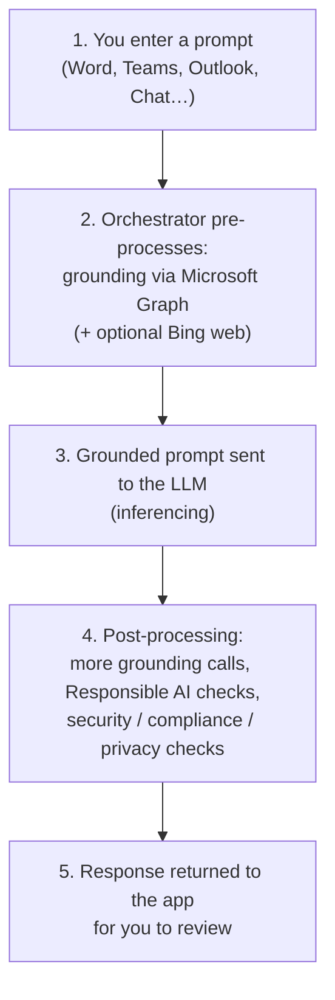

<!-- markdownlint-disable MD041 -->
# Chapter 2 — How Microsoft Copilot Works

*Part I — Generative AI & Responsible AI foundations*

---

## In 30 seconds

- **The core idea**: Microsoft 365 Copilot combines a large language model with *your* organization's
  data. It doesn't answer from the model's memory alone — it **grounds** each prompt in content retrieved
  through Microsoft Graph, then trims that content to what *you* are allowed to see.
- **Why it matters**: grounding, context, and the security boundary explain both *why Copilot is useful* and
  *why it won't leak data*. Every later chapter builds on this pipeline.
- **The exam angle**: expect questions on retrieval-augmented generation (RAG), how context shapes a
  response, and how permissions and data protection restrict what Copilot can return.
- **Remember**: Copilot only surfaces data you already have at least view access to — and your prompts,
  responses, and Graph data are **not** used to train the foundation models.

---

## Exam map

**Exam map — AB-730 · Domain 1: Understand generative AI capabilities across Microsoft 365 experiences · AB-731 · Domain 1: grounding, RAG, secure AI**

---

## 1. Key concepts

In Chapter 1 you saw that a large language model predicts plausible text from its training data. That raises
an obvious problem for business: the model was never trained on *your* quarterly numbers, *your* customer
emails, or *last week's* project chat. Microsoft 365 Copilot solves this by **grounding** — feeding the
model relevant, up-to-date, permission-checked content from your tenant at the moment you ask.

> 📖 **Definition — Grounding**: the process of providing input sources to the LLM related to your prompt,
> so responses are more accurate and contextually relevant. In Microsoft 365 Copilot, grounding data comes
> from Microsoft Graph (your tenant) and, optionally, the web via Bing.

> 📖 **Definition — Microsoft Graph**: the gateway to your organization's data in Microsoft 365 — emails,
> chats, meetings, calendar, contacts, and files — plus the relationships between them. It is where Copilot
> retrieves your working content.

> 📖 **Definition — Retrieval-augmented generation (RAG)**: an AI pattern that *retrieves* relevant data
> and adds it to the prompt before the model *generates* an answer. Copilot's grounding is Microsoft's
> enterprise implementation of RAG.

### Why RAG instead of fine-tuning?

Recall from Chapter 1 that fine-tuning bakes knowledge into a model through extra training. RAG takes the
opposite approach: leave the pretrained model as-is and *supply* the knowledge at query time. For business
data that changes constantly and must respect permissions, RAG wins — it is always current, needs no
retraining, and can enforce access rules on every request.

> 📌 **Key concept**: grounding (RAG) is how Copilot uses *your* data without the cost, staleness, or
> data-exposure risk of training a model on it. This is the single most important idea in the chapter.

### The semantic index

To ground quickly, Copilot relies on the **semantic index** — a map of your Microsoft Graph content built
with both *lexical* (keyword) and *semantic* (meaning-based) indexing. It lets Copilot find conceptually
relevant material, not just exact keyword matches — and it honors your identity-based access boundary.

> 📖 **Definition — Semantic index**: a lexical and semantic index of Microsoft Graph data that lets Copilot
> retrieve conceptually relevant content while respecting each user's access permissions.

---

## 2. How it works

Every Copilot request flows through the **orchestrator**, which coordinates grounding, the LLM call, and a
series of safety and compliance checks.

> 🔍 **How it works**: the LLM never talks to your data directly. The **orchestrator** retrieves grounding
> content, hands the model a prompt enriched with only what you can access, then post-processes the model's
> output — adding citations, running responsible-AI content classifiers, and applying security, compliance,
> and privacy checks — before you ever see it.

### How context shapes the answer

"Context" is anything Copilot can legitimately draw on to make the answer relevant. The exam explicitly
tests that you understand these context sources and their effect:

| Context source | Example | Effect on the response |
| --- | --- | --- |
| **The app you're in** | Chatting in Word vs Excel | Copilot tailors abilities and grounding to that app |
| **Your work files & content** | An open document, recent emails, a meeting | Answers are anchored in your actual material |
| **Web data (optional)** | Web grounding via Bing | Adds current, public information from the web |
| **The conversation so far** | Earlier turns in the chat | Follow-up answers build on prior context |

> 💡 **Tip**: a vague prompt with no useful context produces a generic answer. Point Copilot at the right
> file, email, or meeting — or work inside the relevant app — and the same question yields a far better
> result. (Chapter 3 turns this into a repeatable prompting method.)

### The two Copilots — a quick note

> ⚠️ **Pitfall**: don't confuse **Microsoft 365 Copilot** (grounded in your Microsoft 365 data via Graph,
> the subject of this chapter) with **GitHub Copilot** (a developer tool grounded in your code in the IDE).
> Both are "Copilot," but they ground in different data for different audiences. This book covers Microsoft
> 365 Copilot; GitHub Copilot (exam GH-300) is out of scope.

---

## 3. How Copilot keeps data private and secure

This is a heavily tested area on AB-730. Copilot's protections follow a few clear principles:

- **Permission-trimmed access.** Copilot only surfaces data the individual user already has **at least view
  permission** to, using the *same* Microsoft 365 role-based access controls as the rest of your tenant.
  The semantic index and Microsoft Graph honor this identity-based access boundary on every request.
- **Inside the Microsoft 365 service boundary.** Prompts, retrieved data, and responses are processed
  within your Microsoft 365 service boundary and are protected by encryption (in transit and at rest),
  isolation, and your existing compliance controls.
- **Not used to train foundation models.** Your prompts, responses, and data accessed through Microsoft
  Graph are **not** used to train the underlying foundation LLMs.
- **Honors data protection.** Content protected by Microsoft Purview — for example, **sensitivity labels**
  or encryption — retains its protection; Copilot respects the usage rights granted to the user.
- **Web queries are handled separately.** If web grounding is enabled, the short query sent to Bing has
  user and tenant identifiers **removed**, and it isn't used to train foundation models.

> 📌 **Key concept**: "data protection restricts prompt results." Copilot's answer is *bounded by your
> permissions and policies*. If you can't open a document, Copilot can't use it to answer you. This is a
> feature, not a limitation — and a favorite exam theme.

> 🎯 **Exam tip**: the flip side of permission-trimming is an *oversharing* risk. If a file was already
> shared too broadly (e.g., "anyone in the org"), Copilot makes it *easier to find*. The fix is good data
> hygiene and tools like Microsoft Purview — not disabling Copilot. Expect a scenario testing this nuance.

---

## 4. In the real world

**Scenario — "Summarize where we stand with Contoso."** A key account manager types that prompt into
Microsoft 365 Copilot Chat. Behind the scenes: the orchestrator grounds the prompt through Microsoft Graph,
pulling the manager's recent Contoso emails, the last two meeting recaps, and a shared proposal in
SharePoint — but *only* the items this manager has permission to see. The grounded prompt goes to the LLM,
which drafts a summary; post-processing adds citations to each source and runs safety and compliance checks.
The manager gets a cited, permission-safe summary in seconds.

Change one thing — the manager was never given access to the finance team's private Contoso pricing file —
and that file simply never enters the grounding set. The answer is built only from what the manager could
already have opened by hand. Same prompt, different data, because **permissions define the boundary**.

---

## 5. Exam tips

> 🎯 **Exam tip**: if a question asks *how Copilot uses your organization's data*, the answer involves
> **grounding through Microsoft Graph** (RAG) — not "the model was trained on our data" (it wasn't) and not
> "our data trains the model" (it doesn't).

> 🎯 **Exam tip**: "How does Copilot keep data secure?" → it reuses existing Microsoft 365 permissions
> (identity-based access boundary), stays within the service boundary, honors Purview sensitivity labels,
> and doesn't train foundation models on your content.

> 🎯 **Exam tip**: when a prompt returns a generic or incomplete answer, the likely cause on the exam is
> *missing context or insufficient permissions to the needed content* — not a broken model.

---

## 6. Common pitfalls

> ⚠️ **Pitfall**: believing Copilot "knows everything in the company." It only sees what the *current user*
> can access, retrieved at query time — nothing more.

- **Confusing training with grounding**: Copilot is *grounded* on your data per request; it is not
  *trained* on it. Your data never becomes model weights.
- **Assuming web is always on**: web grounding via Bing is a distinct, optionally enabled path with its own
  data handling; don't assume every answer uses the web.
- **Forgetting context matters**: the same prompt in Excel vs Word, with or without a file attached, yields
  different results — context is part of the input.
- **Treating oversharing as a Copilot flaw**: Copilot exposes pre-existing permission problems faster; the
  remedy is data governance (Purview), not turning Copilot off.

---

## 7. Practice questions

**1.** How does Microsoft 365 Copilot use your organization's data to answer a prompt?

- A. The foundation model was pretrained on your tenant's data
- B. Your data is used to fine-tune the model each night
- C. It grounds the prompt by retrieving relevant content through Microsoft Graph at query time (RAG)
- D. It copies your data to Bing and answers from there

Answer

**Correct: C.** Copilot uses retrieval-augmented generation — grounding the prompt with content retrieved
from Microsoft Graph, respecting permissions. A and B are wrong: your data is not used to train or fine-tune
the foundation models. D misdescribes web grounding, which sends only a short, de-identified query to Bing
and is optional.

**2.** A user asks Copilot to summarize a project, but a critical document is missing from the summary. The
user cannot open that document directly either. What is the most likely explanation?

- A. Copilot is malfunctioning and should be reinstalled
- B. The user lacks permission to the document, so it isn't included in grounding
- C. The document is too long for the model
- D. Web grounding is disabled

Answer

**Correct: B.** Copilot only grounds on content the user has at least view access to. If the user can't open
the file, it never enters the grounding set. A is unfounded; C isn't indicated; D concerns public web
content, not an internal document.

**3.** Which statement about Copilot and data protection is correct?

- A. Copilot ignores sensitivity labels to be more helpful
- B. Prompts and responses are used to train the foundation LLMs
- C. Copilot honors Microsoft Purview sensitivity labels and existing Microsoft 365 permissions
- D. Copilot can access other tenants' data for better answers

Answer

**Correct: C.** Copilot respects Purview protections and the tenant's identity-based access boundary. A and
D are false and would violate the security model; B is explicitly not the case — your content is not used to
train foundation models.

**4.** Why can the *same* prompt produce a better answer when the user attaches a relevant file or works
inside the related app?

- A. Attaching a file retrains the model
- B. Context (the file, the app, recent activity) enriches grounding, making the response more relevant
- C. Files bypass the permission checks
- D. The app changes which foundation model is used for billing

Answer

**Correct: B.** Context is part of the input; richer, relevant context improves grounding and therefore the
answer. A is false (no retraining occurs); C is false (permissions still apply); D is irrelevant to answer
quality.

**5.** An organization worries Copilot will "leak" confidential files to employees who shouldn't see them.
What is the accurate response?

- A. Copilot can surface any file in the tenant regardless of permissions
- B. Copilot only surfaces content the user already has access to; over-permissioned files are a
  pre-existing governance issue best addressed with tools like Microsoft Purview
- C. The only fix is to disable Copilot entirely
- D. Copilot encrypts all files so no one can read them

Answer

**Correct: B.** Copilot enforces existing permissions; it doesn't grant new access. It can make
already-overshared content easier to find, so the right remedy is data governance (e.g., Purview), not
disabling Copilot. A contradicts the security model; C is an overreaction; D is not what happens.

---

## Further reading

- **Chapter 1 — Understanding Generative AI**: why grounding (RAG) beats fine-tuning for business data.
- **Chapter 3 — The Art of the Prompt**: turning "context matters" into a repeatable prompting method.
- **Chapter 4 — Responsible AI in Practice**: the responsible-AI checks in post-processing, plus fabrication
  and verification.
- **Chapter 12 — Extending Copilot**: connecting external data into Microsoft Graph via Copilot connectors.

> 🔗 **Source**: [Microsoft Copilot architecture and how it works (Microsoft Learn)](https://learn.microsoft.com/microsoft-365/copilot/microsoft-365-copilot-architecture)

> 🔗 **Source**: [Data, Privacy, and Security for Microsoft 365 Copilot (Microsoft Learn)](https://learn.microsoft.com/microsoft-365/copilot/microsoft-365-copilot-privacy)

> 🔗 **Source**: [Semantic index for Microsoft 365 Copilot (Microsoft Learn)](https://learn.microsoft.com/microsoftsearch/semantic-index-for-copilot)

> 🔗 **Source**: [Enterprise data protection in Microsoft 365 Copilot (Microsoft Learn)](https://learn.microsoft.com/microsoft-365/copilot/enterprise-data-protection)
