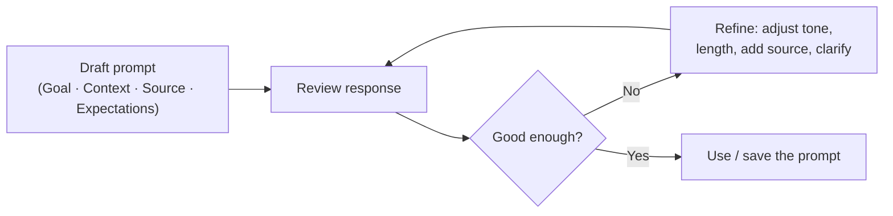

<!-- markdownlint-disable MD041 -->
# Chapter 3 — The Art of the Prompt

*Part I — Generative AI & Responsible AI foundations*

---

## In 30 seconds

- **The core idea**: a strong prompt gives Copilot four things — a clear **Goal**, useful **Context**, the
  right **Source**, and your **Expectations** for the output. This "GCSE" framework is Microsoft's own.
- **Why it matters**: the quality of the answer depends heavily on the quality of the prompt. Prompting is
  tested *conceptually* on AB-731 and *practically* on AB-730.
- **The exam angle**: expect questions on the impact of prompt engineering, the four elements of a good
  prompt, iteration, and choosing which files or data to reference.
- **Remember**: **Goal · Context · Source · Expectations**. If an answer disappoints, a missing element is
  usually why.

---

## Exam map

**Exam map — AB-731 · Domain 1: prompt engineering (impact and techniques) · AB-730 · Domain 2: create effective prompts**

---

## 1. Key concepts

A prompt is simply the natural-language instruction you give Copilot. But *how* you phrase it — and what
context and sources you attach — changes the result dramatically. That deliberate craft is **prompt
engineering**.

> 📖 **Definition — Prompt engineering**: the practice of designing and refining prompts (instructions,
> context, and referenced sources) to get more accurate, relevant, and useful AI output.

Microsoft teaches a simple, exam-relevant model: an effective prompt contains four elements.

> 📌 **Key concept — the four elements (Goal · Context · Source · Expectations)**:
>
> - **Goal** — what you want Copilot to do or produce ("Draft a customer email…").
> - **Context** — why you need it and any background ("…for a client who missed a deadline, keep it warm").
> - **Source** — the specific data Copilot should use ("…based on the attached thread and this proposal").
> - **Expectations** — the desired format, tone, length, or audience ("…three short paragraphs, friendly,
>   under 150 words").

You don't always need all four, but the more high-stakes the task, the more each one matters.

### An example, built up element by element

| Version | Prompt | Why it's better |
| --- | --- | --- |
| Weak | "Write an email." | No goal detail, no context, no source, no format |
| +Goal | "Write an email declining a vendor's proposal." | Clear task |
| +Context | "…they're a long-term partner we want to keep." | Steers tone |
| +Source | "…based on the attached proposal and my notes." | Grounds in real content |
| +Expectations | "…polite, 2 short paragraphs, offer to revisit next quarter." | Shapes the output |

> 💡 **Tip**: reference your **Source** explicitly. In Microsoft 365 Copilot you can point at a file, an
> email, a meeting, or a person using `/` (for example, typing `/` to reference a document). Grounding the
> prompt in the *right* content (Chapter 2) is often the single biggest quality lever.

---

## 2. How it works

### Core techniques

Beyond the four elements, a handful of techniques reliably improve results:

- **Be specific and use action verbs** — "summarize", "compare", "rewrite", "list" beat vague asks.
- **Give the model a role or audience** — "You are my finance analyst… explain this to a non-technical
  executive."
- **Provide examples (few-shot)** — show one or two examples of the format or style you want.
- **Break big tasks into steps** — ask for an outline, then expand; or chain prompts across a conversation.
- **Iterate** — treat the first response as a draft. Refine: "make it shorter", "add a data table", "use a
  more formal tone."
- **Set constraints** — length, tone, format (table, bullet list, email), and what to exclude.

> 🔍 **How it works**: prompting is a *loop*, not a single shot. Because generation is probabilistic
> (Chapter 1), iterating and adding context is how you steer the model toward what you actually want.

### Selecting the right sources

Choosing *which* content to reference is itself a tested skill. Good source selection means pointing Copilot
at material that is **relevant, current, authoritative, and permission-appropriate**.

> 🎯 **Exam tip**: when a question asks which resource to reference, pick the *most relevant and
> authoritative* source for the task — the specific project file, the latest report, the actual meeting —
> not "all files" or an unrelated document. Referencing the right source is more effective than a longer
> prompt.

---

## 3. In the real world

**Scenario — a status update that writes itself.** A project lead needs a weekly status email. A vague "write
my status update" yields generic filler. Instead she prompts:

> "**Goal:** Draft my weekly status email to the steering committee. **Context:** we slipped one milestone
> but recovered two others; keep it confident, not defensive. **Source:** use the attached project plan and
> this week's Teams channel. **Expectations:** 4 short bullets under a one-line summary, executive tone,
> under 120 words."

Copilot grounds in the referenced plan and channel, and returns a tight, on-message draft she edits in
under a minute. The four elements did the work.

---

## 4. Exam tips

> 🎯 **Exam tip**: memorize the four elements — **Goal, Context, Source, Expectations**. Questions often
> show a weak prompt and ask what would most improve it; the answer is usually "add the missing element"
> (most often *Source* or *Expectations*).

> 🎯 **Exam tip**: prompt engineering ≠ coding. On these business exams it means *writing better natural-
> language instructions and choosing good sources* — not programming.

> 🎯 **Exam tip**: iteration is a feature. "Refine the previous response" is often the best next action
> rather than starting a brand-new prompt, because the conversation carries context.

---

## 5. Common pitfalls

> ⚠️ **Pitfall**: the "one perfect prompt" myth. Expecting a flawless answer from a single vague prompt
> leads to disappointment; strong results come from specificity and iteration.

- **Vagueness**: "make this better" gives the model nothing to optimize for — better *how*?
- **No source**: asking about "the project" without referencing the project file forces a generic answer.
- **Overstuffing**: a rambling prompt buries the goal; be complete *and* concise.
- **Wrong source**: referencing an outdated or unrelated document degrades the answer — relevance beats
  volume.
- **Forgetting expectations**: if you don't specify format/length/tone, you get the model's default, which
  may not fit.

---

## 6. Practice questions

**1.** Which set best describes the four elements of an effective Microsoft 365 Copilot prompt?

- A. Goal, Context, Source, Expectations
- B. Question, Answer, Format, Length
- C. Input, Output, Model, Token
- D. Who, What, When, Where

Answer

**Correct: A.** Microsoft's framework for effective prompts is **Goal, Context, Source, Expectations**. The
other options aren't the taught model.

**2.** A user prompts "Summarize the project" and gets a vague answer. What would most improve the result?

- A. Repeat the exact same prompt
- B. Reference the specific project file or meeting as the Source
- C. Switch to a different language
- D. Ask Copilot to use more tokens

Answer

**Correct: B.** The prompt lacks a Source; grounding it in the relevant file or meeting is the biggest
improvement. A changes nothing; C is irrelevant; D isn't a user control and doesn't address the missing
context.

**3.** In the context of these certifications, "prompt engineering" primarily means:

- A. Writing code to fine-tune a model
- B. Crafting clear natural-language instructions and choosing good sources to improve output
- C. Configuring server infrastructure
- D. Training a new large language model

Answer

**Correct: B.** For business users and leaders, prompt engineering is about better instructions and source
selection — no coding or model training involved. A, C, and D describe technical activities outside the
prompt itself.

**4.** A first Copilot response is close but too long and too formal. What is the best next step?

- A. Start over with a completely new chat
- B. Iterate: ask Copilot to shorten it and use a warmer tone
- C. Accept it as-is
- D. Report the model as broken

Answer

**Correct: B.** Iterating within the conversation preserves context and refines the draft efficiently. A
discards useful context; C ignores the quality gap; D is unwarranted.

**5.** Which prompt best applies the four elements?

- A. "Write something about sales."
- B. "Draft a 3-bullet summary of Q3 sales for the leadership review, using the attached sales report, in a
  concise executive tone."
- C. "Sales report?"
- D. "Make a great sales document, you decide everything."

Answer

**Correct: B.** It states the Goal (3-bullet summary), Context (leadership review), Source (attached sales
report), and Expectations (concise executive tone). The others are vague and missing most elements.

---

## Further reading

- **Chapter 2 — How Microsoft Copilot Works**: why referencing the right Source improves grounding.
- **Chapter 6 — Creating and Managing Prompts**: saving, scheduling, and sharing prompts in practice
  (AB-730), including the Copilot Prompt Gallery.
- **Chapter 9 — Drafting Business Documents**: applying prompts to real deliverables.

> 🔗 **Source**: [Write effective prompts to achieve optimal results (Microsoft Learn training)](https://learn.microsoft.com/training/modules/write-effective-prompts-do-more-prompting/)

> 🔗 **Source**: [Craft effective prompts for Microsoft 365 Copilot (Microsoft Learn learning path)](https://learn.microsoft.com/training/paths/craft-effective-prompts-copilot-microsoft-365/)
