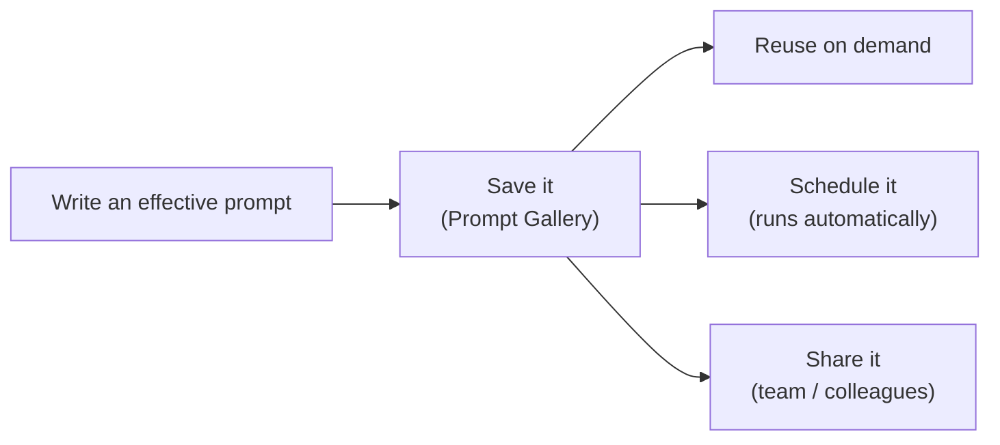

<!-- markdownlint-disable MD041 -->
# Chapter 6 — Creating and Managing Prompts

*Part II — AB-730 track: Working with Microsoft 365 Copilot*

---

## In 30 seconds

- **The core idea**: good prompts are assets. Microsoft 365 Copilot lets you **save**, **schedule**, and
  **share** prompts — and discover ready-made ones in the **Copilot Prompt Gallery**.
- **Why it matters**: these are explicit, hands-on AB-730 objectives, tested as "how do you…" tasks.
- **The exam angle**: expect task-oriented questions ("how do you reuse a prompt every Monday?", "how do you
  give your team a prompt you wrote?").
- **Remember**: **save** for reuse · **schedule** to run automatically · **share** to spread good prompts.

---

## Exam map

**Exam map — AB-730 · Domain 2: Create and manage prompts in Microsoft 365 Copilot**

---

## 1. Key concepts

Chapter 3 covered *how to write* a strong prompt (Goal · Context · Source · Expectations). This chapter is
about *managing* prompts once you have good ones — the practical actions AB-730 tests.

> 📖 **Definition — Copilot Prompt Gallery**: a library in Microsoft 365 Copilot where you can discover
> ready-made prompts, and save, edit, and share your own. It's the home base for prompt management.

> 📌 **Key concept**: a well-crafted prompt is reusable work. Saving, scheduling, and sharing turn a
> one-time effort into a repeatable, team-wide productivity gain.

### Referencing resources in a prompt

When writing the prompt, you select the **Source** (Chapter 3) by referencing specific content. In Copilot
you typically type `/` to point at a file, email, meeting, or person, so the prompt is grounded in exactly
the right material.

> 💡 **Tip**: reference the *specific* item (this file, that meeting) rather than hoping Copilot finds it.
> Precise sourcing is the biggest quality lever and makes a saved prompt reliable when reused.

---

## 2. How it works — save, schedule, share

### Saving a prompt

Save a prompt you'll want again — from the Prompt Gallery or directly from the Copilot prompt box. Saved
prompts appear in your gallery for one-click reuse, so you don't rewrite them.

### Scheduling a prompt

**Scheduled prompts** run automatically on a cadence you set (for example, every Monday at 8 a.m.) and
deliver the result to you — ideal for recurring digests like "summarize last week's activity in the project
channel."

> 🔍 **How it works**: a scheduled prompt is just a saved prompt with a time trigger. Copilot runs it on
> schedule, grounds it in your current data at run time, and returns a fresh result.

> 🎯 **Exam tip**: if a scenario says "automatically, every week/day, without me re-running it," the answer
> is **schedule the prompt** — not save, and not share.

### Sharing a prompt

Share a strong prompt with colleagues so the whole team benefits. Sharing distributes the *prompt* (the
reusable instruction), while each person's run still respects **their own** permissions and grounding
(Chapter 2).

> ⚠️ **Pitfall**: sharing a prompt does **not** share the data or results. A teammate who runs your shared
> prompt only sees content *they* have access to — the permission boundary still applies.

---

## 3. In the real world

**Scenario — the Monday digest.** A team lead writes a prompt: "Summarize last week's updates in the
/Project-Falcon channel into 5 bullets with owners and due dates." He **saves** it to the Prompt Gallery,
**schedules** it for Monday 8 a.m. so the digest is waiting when he logs in, and **shares** it with his
leads so each gets the same digest scoped to their own access. One good prompt, written once, now serves the
whole team automatically.

---

## 4. Exam tips

> 🎯 **Exam tip**: map the verb to the action — *reuse later* → **save**; *runs automatically on a cadence* →
> **schedule**; *give it to colleagues* → **share**.

> 🎯 **Exam tip**: the **Copilot Prompt Gallery** is where you discover, save, edit, and share prompts —
> remember the name.

> 🎯 **Exam tip**: sharing a prompt shares the *instruction*, not the data; results remain permission-
> trimmed per user.

---

## 5. Common pitfalls

> ⚠️ **Pitfall**: confusing *save* with *schedule*. Saving stores a prompt for manual reuse; scheduling runs
> it automatically.

- **Assuming shared prompts leak data**: they don't — each run respects the runner's permissions.
- **Rewriting the same prompt repeatedly**: save it instead; that's the whole point of the gallery.
- **Vague sources in a saved prompt**: a reusable prompt should reference stable, relevant sources or it
  won't hold up over time.

---

## 6. Practice questions

**1.** A user wants a weekly summary delivered automatically every Monday without manually running it. What
should they do?

- A. Save the prompt
- B. Share the prompt
- C. Schedule the prompt
- D. Rename the chat

Answer

**Correct: C.** Scheduling runs a prompt automatically on a cadence. Saving only stores it for manual reuse;
sharing distributes it; renaming a chat is unrelated.

**2.** Where can a user discover ready-made prompts and save their own in Microsoft 365 Copilot?

- A. The Copilot Prompt Gallery
- B. The Recycle Bin
- C. The SharePoint admin center
- D. Microsoft Purview

Answer

**Correct: A.** The Copilot Prompt Gallery is the library for discovering, saving, editing, and sharing
prompts. The others are unrelated to prompt management.

**3.** A manager shares a useful prompt with their team. What does a teammate see when they run it?

- A. The manager's data and results
- B. Only content the teammate personally has permission to access
- C. Nothing — shared prompts can't be run
- D. All company data

Answer

**Correct: B.** Sharing distributes the prompt, not the data; each run is grounded and permission-trimmed
for the person running it. A and D would violate the security model; C is false.

**4.** Which action best turns a one-time effort into repeatable value with the least ongoing effort?

- A. Copy the prompt into a personal notepad
- B. Save it to the Prompt Gallery (and schedule/share as needed)
- C. Memorize it
- D. Re-type it each time

Answer

**Correct: B.** Saving to the gallery — optionally scheduling and sharing — makes the prompt reusable and
distributable. The others are manual and error-prone.

---

## Further reading

- **Chapter 3 — The Art of the Prompt**: writing the effective prompt you then save and reuse.
- **Chapter 7 — Managing Conversations**: organizing chats, notebooks, and history.
- **Chapter 8 — Building and Using Copilot Agents**: when a reusable prompt should become an agent.

> 🔗 **Source**: [Discover, share, and save prompts with Copilot Prompt Gallery (Microsoft Learn training)](https://learn.microsoft.com/training/modules/write-effective-prompts-do-more-prompting/4-discover-share-save-prompts-copilot-prompt-gallery)

> 🔗 **Source**: [Microsoft 365 Copilot Prompt Gallery (Microsoft Learn)](https://learn.microsoft.com/copilot/microsoft-365/copilot-prompt-gallery)
