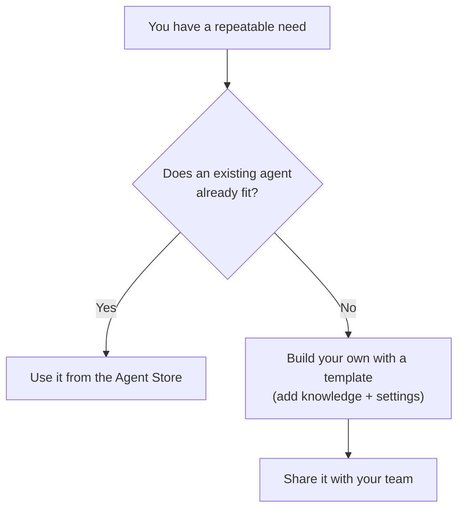

<!-- markdownlint-disable MD041 -->
# Chapter 8 — Building and Using Copilot Agents

*Part II — AB-730 track: Working with Microsoft 365 Copilot*

---

## In 30 seconds

- **The core idea**: **agents** are purpose-built Copilots. You can get one from the **Agent Store** or build
  your own from a **template**, give it **knowledge**, configure its **instructions / capabilities /
  suggested prompts**, and **share** it — all with no code.
- **Why it matters**: agents are a large, explicit part of AB-730 Domain 2.
- **The exam angle**: expect questions on Agent Store vs building your own, and on each configuration
  element.
- **Remember**: **use an existing agent** when one fits; **build one** when you need specific knowledge and
  consistent, reusable behavior.

---

## Exam map

**Exam map — AB-730 · Domain 2: Create and manage Microsoft 365 Copilot agents**

---

## 1. Key concepts

> 📖 **Definition — Agent**: a customized assistant built on Microsoft 365 Copilot, scoped to a specific job
> with its own instructions, knowledge, and suggested prompts. Agents range from simple Q&A helpers to more
> autonomous task performers.

> 📖 **Definition — Agent Store**: the catalog where you find and add ready-made agents — from Microsoft,
> partners, and your own organization — without building anything.

> 📖 **Definition — Copilot agent builder**: the no-code tool for creating a *declarative* agent by
> describing what it should do, giving it knowledge, and configuring its settings.

### Agent Store vs creating your own

> 📌 **Key concept**: don't build what already exists. Check the **Agent Store** first; create a **new**
> agent when your need is specific to *your* content and process and no existing agent covers it.

> 🎯 **Exam tip**: "understand when to use Agent Store versus creating a new agent" is stated verbatim in
> the objectives. Existing/general need → Agent Store. Specific knowledge + consistent behavior + reuse →
> build your own.

---

## 2. How it works — building and configuring an agent

You create an agent from a **template** in the agent builder, then configure four things:

| Setting | What it controls | Example |
| --- | --- | --- |
| **Instructions** | How the agent behaves, its tone, its rules | "Answer HR policy questions; cite the policy; be concise" |
| **Knowledge** | The sources it grounds on | A SharePoint site of HR policies |
| **Capabilities** | Extra abilities you enable | Web search, image generation, code interpreter |
| **Suggested prompts** | Starter prompts shown to users | "How many vacation days do I get?" |

> 🔍 **How it works**: an agent grounds on the **knowledge** you attach (for example, a SharePoint site),
> respecting each user's permissions — the same boundary as Chapter 2. Its **instructions** shape every
> response so behavior is consistent for everyone who uses it.

> 💡 **Tip**: good agent instructions read like a clear job description — what it does, what sources to use,
> what tone, and what it should *not* do. This is prompt engineering (Chapter 3) applied to configuration.

### Sharing an agent

Once built, **share** the agent with teammates so everyone gets the same purpose-built help. As always,
each user's results stay permission-trimmed to what *they* can access.

> ⚠️ **Pitfall**: sharing an agent doesn't grant users access to its knowledge sources they couldn't
> otherwise see. If a teammate lacks permission to the underlying SharePoint site, the agent won't surface
> that content to them.

---

## 3. In the real world

**Scenario — the HR helpdesk agent.** HR is flooded with the same policy questions. Instead of answering
each one, an HR lead opens the agent builder, starts from a template, writes **instructions** ("answer
employee questions using our official HR policies, cite the source, stay concise"), attaches the HR policy
**SharePoint site** as **knowledge**, adds **suggested prompts** ("How do I request parental leave?"), and
**shares** it with all staff. Employees get instant, consistent, cited answers — and each person only sees
policies they're allowed to. No code, no new headcount.

---

## 4. Exam tips

> 🎯 **Exam tip**: know the four configuration elements — **instructions, knowledge, capabilities, suggested
> prompts** — and what each does.

> 🎯 **Exam tip**: agents are built **without code** (the agent builder is no-code). Answers implying you
> must program an agent are wrong for these business exams.

> 🎯 **Exam tip**: an agent's knowledge respects permissions. Sharing an agent shares the *assistant*, not
> access to its underlying data.

---

## 5. Common pitfalls

> ⚠️ **Pitfall**: building a new agent when a suitable one already exists in the Agent Store — check first.

- **Vague instructions**: an agent with weak instructions behaves inconsistently; be explicit about scope,
  sources, and tone.
- **Wrong or missing knowledge**: without the right knowledge source, an agent can't ground answers in your
  content.
- **Assuming sharing grants data access**: it doesn't — permissions to knowledge sources still apply.
- **Thinking agents require coding**: the agent builder is no-code.

---

## 6. Practice questions

**1.** A team needs an assistant that answers questions from their internal product documentation,
consistently, for everyone. No suitable agent exists. What's the best approach?

- A. Tell everyone to use general chat and re-explain context each time
- B. Build a new agent, attach the product docs as knowledge, configure instructions, and share it
- C. Email the documentation to everyone
- D. Fine-tune a custom language model

Answer

**Correct: B.** A specific, repeatable, knowledge-scoped need with no existing agent is exactly when to
build one. A is inefficient; C isn't AI-assisted; D is unnecessary and out of scope (no code / no fine-
tuning needed).

**2.** Which agent setting determines the sources an agent uses to ground its answers?

- A. Suggested prompts
- B. Capabilities
- C. Knowledge
- D. The agent's name

Answer

**Correct: C.** Knowledge defines the grounding sources (e.g., a SharePoint site). Suggested prompts are
starter questions; capabilities add abilities like web search; the name is just a label.

**3.** When should you use the Agent Store instead of building your own agent?

- A. Never — always build from scratch
- B. When an existing agent already meets the need
- C. Only when you can write code
- D. Only for personal use

Answer

**Correct: B.** If a ready-made agent fits, use it rather than rebuilding. A wastes effort; C and D are
irrelevant to the choice.

**4.** A shared HR agent uses a SharePoint site as its knowledge. A contractor without access to that site
uses the agent. What happens?

- A. The agent surfaces the restricted content anyway
- B. The agent won't surface content the contractor lacks permission to see
- C. The agent grants the contractor access to the site
- D. The agent stops working for everyone

Answer

**Correct: B.** Agents honor each user's permissions; sharing the agent doesn't grant data access. A and C
violate the security model; D is false.

**5.** Which set correctly lists agent configuration options in Microsoft 365 Copilot?

- A. Instructions, knowledge, capabilities, suggested prompts
- B. CPU, memory, disk, network
- C. Fonts, colors, themes, icons
- D. Tokens, weights, layers, epochs

Answer

**Correct: A.** Those are the agent-builder settings. B is infrastructure; C is cosmetic; D are
model-training internals irrelevant to configuring a no-code agent.

---

## Further reading

- **Chapter 5 — The Copilot Experience Across Microsoft 365**: chat vs agent, and the use case for your own
  agent.
- **Chapter 3 — The Art of the Prompt**: writing clear instructions (prompt engineering applied to agents).
- **Chapter 12 — Extending Copilot**: Copilot Studio and the extensibility framework for more advanced
  agents (AB-731).

> 🔗 **Source**: [Build agents with Microsoft 365 Copilot (agent builder) (Microsoft Learn)](https://learn.microsoft.com/microsoft-365/copilot/extensibility/agent-builder-build-agents)

> 🔗 **Source**: [Agents for Microsoft 365 Copilot overview (Microsoft Learn)](https://learn.microsoft.com/microsoft-365/copilot/extensibility/overview-business-applications)
