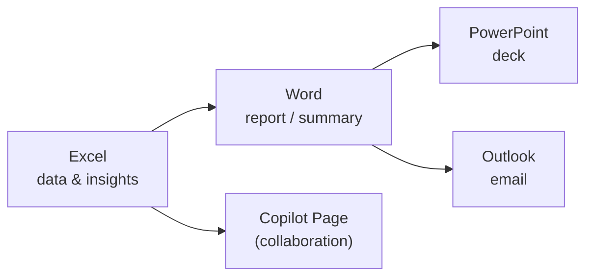

<!-- markdownlint-disable MD041 -->
# Chapter 9 — Drafting Business Documents & Communications

*Part II — AB-730 track: Working with Microsoft 365 Copilot*

---

## In 30 seconds

- **The core idea**: Copilot **drafts** documents from a prompt or an existing file, **summarizes** them
  (including management summaries), and helps **move insights** between Microsoft 365 apps.
- **Why it matters**: "draft and analyze business content" is a full AB-730 domain (25–30%).
- **The exam angle**: expect scenario questions on generating a document from a prompt or a file, producing
  a management summary, and moving data/insights across apps.
- **Remember**: Copilot produces a **first draft to refine**, grounded in the file or data you point it at.

---

## Exam map

**Exam map — AB-730 · Domain 3: Draft business documents and communications**

---

## 1. Key concepts

Drafting is where Copilot most visibly saves time. The exam covers four related tasks:

| Task | What Copilot does | Typical app |
| --- | --- | --- |
| **New document from a prompt** | Generates a full first draft from your instructions | Word |
| **Document from an existing document** | Transforms a source file into a new artifact | Word → PowerPoint |
| **Management summary** | Condenses a long document into an executive-level summary | Word |
| **Move data & insights** | Carries content/insights from one app into another | Excel → Word / Pages |

> 📌 **Key concept**: every one of these is **grounded** (Chapter 2) — the better you specify the *Source*
> (Chapter 3), the better the draft. "Generate from this file" beats "generate from scratch" when a source
> exists.

> 📖 **Definition — Management summary**: a concise, executive-oriented overview of a longer document — key
> points, decisions, and implications — aimed at a busy decision-maker.

---

## 2. How it works

### Create a new document from a prompt

In Word, Copilot's **Draft** turns a prompt into a full first draft — a proposal, a policy, a plan. Apply
the four elements (Goal · Context · Source · Expectations) and Copilot produces structured text you refine.

### Generate a document from an existing document

Point Copilot at a source file and ask for a new artifact: turn a Word brief into a **PowerPoint** deck,
turn meeting notes into a project plan, or rewrite a long report into a one-pager. The source grounds the
output so it stays faithful to your material.

### Generate a management summary

Ask Copilot to summarize a long document "for the leadership team in five bullets with the decision needed."
Specifying the *audience* and *format* (Expectations) is what makes it a *management* summary rather than a
generic one.

### Move data and insights between apps

Copilot helps content flow: pull an insight from an **Excel** analysis into a **Word** report, summarize a
Word document into an **Outlook** email, or send a chat's output into a **Copilot Page** (Chapter 10) for
collaboration.

> 🔍 **How it works**: moving insights isn't a raw copy-paste — Copilot re-expresses the content for the
> destination (a chart insight becomes a sentence in a report; a report becomes an email). You still review
> and refine.

> 💡 **Tip**: always treat the output as a **draft**. Copilot accelerates the first 80%; your judgment and
> verification (Chapter 4) finish it — especially for anything external or high-stakes.

---

## 3. In the real world

**Scenario — from spreadsheet to board update in minutes.** A finance manager has a detailed Excel model.
She asks Copilot in Excel to surface the key trend, then drafts a **Word** report grounded in the model,
generates a **management summary** "for the board, 4 bullets, decision required at the top," and finally has
Copilot turn the summary into a concise **Outlook** email to the CFO. Four apps, one chain of grounded
drafts, each reviewed before it goes out. What took a morning now takes fifteen minutes of drafting plus
careful review.

---

## 4. Exam tips

> 🎯 **Exam tip**: "generate a document *from an existing document*" (e.g., Word → PowerPoint) is distinct
> from "create *from a prompt*." Match the scenario: is there a source file to build on?

> 🎯 **Exam tip**: a *management summary* is defined by its **audience and brevity**. The right prompt names
> the audience (leadership/board) and the format (few bullets, decision-focused).

> 🎯 **Exam tip**: "move data and insights between apps" means Copilot re-expresses content for the target
> app (Excel insight → Word paragraph → Outlook email), not that it just copies cells.

---

## 5. Common pitfalls

> ⚠️ **Pitfall**: shipping Copilot's first draft unedited. It's a starting point; review for accuracy, tone,
> and completeness — especially externally.

- **Ignoring the source**: generating "from scratch" when a relevant file exists wastes Copilot's grounding
  advantage.
- **Generic summaries**: omitting the audience/format yields a summary that isn't fit for leadership.
- **Over-trusting moved insights**: verify that a figure carried into a report still matches the source.

---

## 6. Practice questions

**1.** A user has a detailed Word proposal and needs a slide deck that reflects it. What's the best Copilot
approach?

- A. Retype the proposal into PowerPoint manually
- B. Use Copilot in PowerPoint to generate the deck from the existing Word document
- C. Ask Copilot in Excel to build slides
- D. Fine-tune a model on the proposal

Answer

**Correct: B.** Generating a document from an existing document (Word → PowerPoint) is a core capability. A
is manual; C is the wrong app; D is unnecessary and out of scope.

**2.** What makes a Copilot output a *management summary* rather than a generic summary?

- A. It is always exactly one page
- B. It specifies an executive audience and a concise, decision-focused format
- C. It uses more tokens
- D. It removes all data

Answer

**Correct: B.** A management summary is defined by audience (leadership) and brevity/decision focus — driven
by your Expectations in the prompt. The others don't define it.

**3.** "Move data and insights between Microsoft 365 apps" with Copilot best describes which action?

- A. Copying raw cells with no changes
- B. Having Copilot re-express an Excel insight as a paragraph in a Word report, or a report as an email
- C. Exporting a file to PDF
- D. Deleting data from one app

Answer

**Correct: B.** Copilot re-expresses content appropriately for the destination app. A is a plain copy; C and
D are unrelated.

**4.** For a high-stakes external proposal drafted by Copilot, what is the responsible final step?

- A. Send it immediately
- B. Review and verify the draft (facts, tone, completeness) before sending
- C. Delete it
- D. Add more tokens

Answer

**Correct: B.** Copilot drafts; humans verify — especially for external, high-stakes content (Chapter 4). A
risks errors; C and D are irrelevant.

---

## Further reading

- **Chapter 3 — The Art of the Prompt**: the Goal/Context/Source/Expectations that drive good drafts.
- **Chapter 4 — Responsible AI in Practice**: verifying drafts before they go out.
- **Chapter 10 — Meetings, Collaboration & Copilot Pages**: turning content into collaborative Pages.

> 🔗 **Source**: [Microsoft 365 Copilot in Word (Microsoft Learn)](https://learn.microsoft.com/copilot/microsoft-365/microsoft-365-copilot-word)

> 🔗 **Source**: [Microsoft 365 Copilot overview (Microsoft Learn)](https://learn.microsoft.com/microsoft-365/copilot/microsoft-365-copilot-overview)
