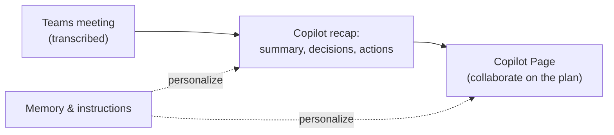

<!-- markdownlint-disable MD041 -->
# Chapter 10 — Meetings, Collaboration & Copilot Pages

*Part II — AB-730 track: Working with Microsoft 365 Copilot*

---

## In 30 seconds

- **The core idea**: Copilot helps you run and catch up on **meetings**, collaborate on **Copilot Pages**,
  and personalize its help through **memory and instructions**.
- **Why it matters**: "manage meetings and collaboration" is an explicit AB-730 objective.
- **The exam angle**: expect questions on Copilot in Teams meetings, Copilot Pages for collaboration, and how
  memory and instructions shape responses.
- **Remember**: **meetings** = recap and catch up; **Pages** = collaborate on shareable content; **memory** =
  Copilot remembers your context to help better.

---

## Exam map

**Exam map — AB-730 · Domain 3: Manage meetings and collaboration**

---

## 1. Key concepts

### Copilot for meetings

In Microsoft Teams, Copilot works alongside a meeting to summarize discussion in real time, answer "what did
I miss?" if you join late, and produce a **recap** afterward with key points, decisions, and action items.

> 🔍 **How it works**: Copilot grounds on the meeting's transcript/recording (when enabled). No transcript,
> no meeting grounding — so recap and "catch up" depend on transcription being on.

> 🎯 **Exam tip**: Copilot's meeting abilities (recap, action items, real-time Q&A) generally require the
> meeting to be **transcribed or recorded**. If a scenario says transcription is off, those abilities aren't
> available.

### Copilot Pages

> 📖 **Definition — Copilot Pages**: a persistent, collaborative canvas where you turn Copilot responses
> into durable content that you and colleagues can edit together in real time.

Pages take an ephemeral chat answer and make it **durable and shared** — you (and teammates) can iterate on
it with Copilot's help. It's the collaboration counterpart to the personal **notebook** (Chapter 7).

> 📌 **Key concept**: **notebook = personal** ongoing workspace; **Page = collaborative** shared content.
> The exam likes to test this pairing.

### Memory and instructions

> 📖 **Definition — Memory**: Copilot's ability to remember useful context about you (your role,
> preferences, ongoing work) to make responses more relevant over time.

> 📖 **Definition — Instructions**: standing guidance you give Copilot (preferred tone, format, role) that
> it applies to your interactions, so you don't repeat yourself each time.

> 🔍 **How it works**: memory and instructions personalize Copilot — like giving a new assistant your
> preferences once. They shape responses within your permission boundary; they don't override security.

---

## 2. How it works together

> 💡 **Tip**: after a meeting, move the recap's action items into a **Copilot Page** so the team can turn
> the discussion into a shared, editable plan — collaboration that outlives the meeting.

---

## 3. In the real world

**Scenario — the meeting that becomes a plan.** A product team holds a transcribed Teams meeting. A member
who joins late asks Copilot "catch me up," and gets the gist instantly. Afterward, Copilot produces a
**recap** with decisions and action items. The lead turns that recap into a **Copilot Page**, where the team
collaboratively refines the plan with Copilot's help. Because the lead set **instructions** ("keep summaries
concise, list owners and dates"), every recap already arrives in the format the team prefers.

---

## 4. Exam tips

> 🎯 **Exam tip**: meeting recap/catch-up depends on **transcription/recording** being enabled.

> 🎯 **Exam tip**: **Copilot Pages = collaboration**; **notebooks = personal workspace** (Chapter 7). Don't
> mix them up.

> 🎯 **Exam tip**: **memory** remembers context to personalize help; **instructions** are standing
> preferences you set. Both improve relevance but never bypass permissions.

---

## 5. Common pitfalls

> ⚠️ **Pitfall**: expecting a meeting recap when the meeting wasn't transcribed or recorded — Copilot has
> nothing to ground on.

- **Confusing Pages with notebooks**: Pages are collaborative and shareable; notebooks are personal.
- **Assuming memory overrides security**: personalization still respects the permission boundary.
- **Losing meeting outcomes**: capture recaps/action items into a Page so they become a shared plan.

---

## 6. Practice questions

**1.** A user joins a Teams meeting late and wants to know what they missed. What enables Copilot to help?

- A. Nothing is required
- B. The meeting must be transcribed or recorded so Copilot can ground on it
- C. The user must be an admin
- D. The user must fine-tune a model

Answer

**Correct: B.** Copilot's catch-up and recap ground on the meeting transcript/recording. Without it, there's
nothing to summarize. A, C, and D are incorrect.

**2.** A team wants to turn a Copilot response into shared content they can edit together. What should they
use?

- A. A Copilot Page
- B. A personal notebook
- C. A deleted chat
- D. A scheduled prompt

Answer

**Correct: A.** Copilot Pages are the collaborative, shareable canvas. A notebook is personal; a deleted
chat is gone; a scheduled prompt automates a run, not collaboration.

**3.** What is the difference between Copilot memory and instructions?

- A. They are the same thing
- B. Memory remembers useful context about you; instructions are standing preferences you set to guide
  responses
- C. Memory bypasses permissions; instructions grant admin rights
- D. Both are only for developers

Answer

**Correct: B.** Memory personalizes based on remembered context; instructions are guidance you provide.
Neither bypasses security (ruling out C); A and D are false.

**4.** Which best pairs the tool to its purpose?

- A. Notebook = collaboration; Page = personal
- B. Page = collaboration; Notebook = personal workspace
- C. Both are for meetings only
- D. Both are the same as a chat

Answer

**Correct: B.** Pages are collaborative; notebooks are personal. A reverses them; C and D are wrong.

---

## Further reading

- **Chapter 7 — Managing Conversations**: notebooks (the personal counterpart to Pages).
- **Chapter 9 — Drafting Business Documents**: turning meeting outputs into documents and summaries.
- **Chapter 2 — How Microsoft Copilot Works**: why memory and personalization never bypass permissions.

> 🔗 **Source**: [Microsoft 365 Copilot in Teams meetings (Microsoft Learn)](https://learn.microsoft.com/copilot/microsoft-365/microsoft-365-copilot-teams)

> 🔗 **Source**: [Copilot Pages (Microsoft Learn)](https://learn.microsoft.com/copilot/microsoft-365/copilot-pages)
