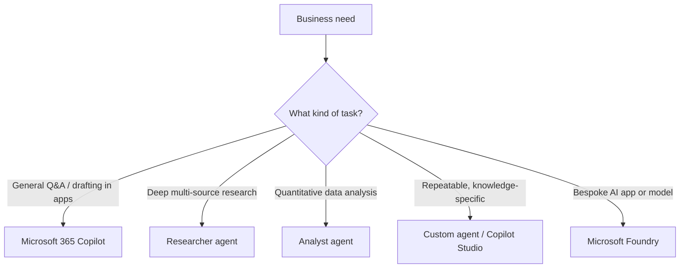

<!-- markdownlint-disable MD041 -->
# Chapter 11 — The Microsoft AI Portfolio

*Part III — AB-731 track: Leading AI Transformation*

---

## In 30 seconds

- **The core idea**: Microsoft's AI offering is a **spectrum** — from free web chat, to licensed Microsoft
  365 Copilot grounded in your work data, to specialized agents like **Researcher** and **Analyst**, to the
  custom **Foundry** platform. A leader maps each business need to the right tier.
- **Why it matters**: this is a large, explicit AB-731 domain (35–40%).
- **The exam angle**: expect questions comparing Copilot versions, choosing **Researcher vs Analyst**, and
  the benefits of an *integrated* Microsoft AI solution.
- **Remember**: the value climbs as you move from **web-grounded chat** → **work-grounded Copilot** →
  **agents** → **custom solutions**.

---

## Exam map

**Exam map — AB-731 · Domain 2: Identify benefits and capabilities of Microsoft 365 Copilot and Microsoft Copilot**

> 📌 **Key concept**: Microsoft 365 Copilot is **not** GitHub Copilot. This chapter clarifies the Microsoft
> AI portfolio; GitHub Copilot (exam GH-300) is out of scope for AB-731 and is covered in a separate
> companion volume.

---

## 1. Key concepts

### The Copilot spectrum

| Tier | What it is | Grounding | Typical licensing |
| --- | --- | --- | --- |
| **Microsoft Copilot** (Copilot Chat) | General AI chat on web and mobile | Web; **work data** with a license | Free / included; more with a license |
| **Microsoft 365 Copilot** | Copilot embedded in Word, Excel, Teams, Outlook, etc. | Your **work data** via Microsoft Graph | Per-user subscription |
| **Agents** | Purpose-built assistants (incl. Researcher, Analyst) | Configured knowledge + tools | Included / consumption |
| **Microsoft Copilot Studio** | Build/customize agents at scale | Your chosen data & systems | Consumption (Chapter 12) |
| **Microsoft Foundry** | Build custom AI apps and models | Anything you connect | Consumption (Chapter 13) |

> 📌 **Key concept**: "differences between versions of Copilot" usually comes down to **grounding and
> licensing** — web-only chat vs work-grounded Microsoft 365 Copilot — and which apps/agents are included.

### Researcher and Analyst

Two built-in Microsoft 365 Copilot agents are named directly in the objectives:

> 📖 **Definition — Researcher**: an agent for complex, multi-step **research** — it reasons over your work
> data and the web to produce thorough, cited outputs (market analyses, briefings).

> 📖 **Definition — Analyst**: an agent for **data analysis** — it works through raw data (e.g.,
> spreadsheets) like a data analyst to produce insights, tables, and visualizations.

> 🎯 **Exam tip**: **Researcher = deep, multi-source research and synthesis**; **Analyst = quantitative data
> analysis**. Match the verb: "investigate/synthesize/report" → Researcher; "analyze this data/compute
> trends" → Analyst.

---

## 2. How it works — mapping processes to Copilot

A transformation leader's core skill here is **mapping business processes and use cases** to the right
capability.

> 🔍 **How it works**: the same grounding and responsible-AI foundations (Chapters 2 and 4) run underneath
> the whole portfolio. Choosing a tier is about *fit and cost*, not a different safety model.

### The value of an integrated solution

Because these pieces share identity, security, grounding, and compliance, an **integrated** Microsoft AI
solution reduces risk: consistent data protection, one permission model, unified governance, and safety
built in — rather than stitching together disconnected tools.

> 🎯 **Exam tip**: "benefits of an integrated Microsoft AI solution" → **risk mitigation and safety** from a
> shared security/compliance foundation, plus lower integration effort and consistent user experience.

---

## 3. In the real world

**Scenario — matching tools to a quarter's work.** A strategy director needs three things: a market briefing,
a churn analysis, and a recurring policy-answer helper. She maps each to the portfolio: **Researcher** for
the multi-source market briefing; **Analyst** for the churn data; and a **custom agent** (built in the agent
builder, Chapter 8) for policy answers. All run on the same secure Microsoft 365 foundation, so IT governs
them consistently — the benefit of an integrated solution.

---

## 4. Exam tips

> 🎯 **Exam tip**: Researcher vs Analyst is a near-certain question. Research/synthesis → Researcher; numeric
> data analysis → Analyst.

> 🎯 **Exam tip**: "version" differences hinge on **grounding (web vs work data) and licensing**, plus which
> apps and agents are included.

> 🎯 **Exam tip**: integrated-solution benefits = risk mitigation, safety, consistent governance — not just
> "more features."

---

## 5. Common pitfalls

> ⚠️ **Pitfall**: conflating **Microsoft 365 Copilot** with **GitHub Copilot**. Different products, data, and
> audiences — a favorite trap.

- **Mixing up Researcher and Analyst**: research/synthesis vs quantitative analysis.
- **Assuming free chat grounds in work data**: work-data grounding requires the Microsoft 365 Copilot
  license.
- **Over-building**: not every need requires Foundry — map to the *simplest* tier that fits (echoes
  Chapter 1).

---

## 6. Practice questions

**1.** A leader needs a thorough, cited market briefing that synthesizes internal documents and web sources.
Which Copilot agent fits best?

- A. Analyst
- B. Researcher
- C. GitHub Copilot
- D. A rule-based bot

Answer

**Correct: B.** Researcher handles deep, multi-source research and synthesis with citations. Analyst is for
quantitative data; GitHub Copilot is a developer tool; a rule-based bot can't synthesize.

**2.** What most distinguishes free Microsoft Copilot chat from Microsoft 365 Copilot?

- A. Color scheme
- B. Microsoft 365 Copilot grounds in your work data via Microsoft Graph (with a license); free chat is
  primarily web-grounded
- C. Only free chat is secure
- D. They are identical

Answer

**Correct: B.** The key difference is grounding in work data (licensed) vs web. A is trivial; C is false;
D is wrong.

**3.** Which is a benefit of an *integrated* Microsoft AI solution?

- A. Each tool has its own separate security model
- B. A shared security, permission, and compliance foundation that mitigates risk and improves safety
- C. It removes the need for any governance
- D. It only works offline

Answer

**Correct: B.** Integration means a consistent, secure foundation — risk mitigation and safety. A is the
opposite; C is false (governance still matters); D is irrelevant.

**4.** A team needs quantitative analysis of a large sales spreadsheet. Which agent is designed for this?

- A. Researcher
- B. Analyst
- C. Prompt Coach
- D. Copilot Pages

Answer

**Correct: B.** Analyst performs data analysis like a data analyst. Researcher is for research; Prompt Coach
helps write prompts; Pages is collaboration.

---

## Further reading

- **Chapter 5 — Copilot Across Microsoft 365**: the chat and app experiences from the user's side.
- **Chapter 12 — Extending Copilot**: Copilot Studio, Microsoft Graph, and build/buy/extend.
- **Chapter 13 — Microsoft Foundry & Foundry Tools**: the custom end of the spectrum.
- **Chapter 14 — Building the Business Case**: licensing that differentiates the versions.

> 🔗 **Source**: [Microsoft 365 Copilot overview (Microsoft Learn)](https://learn.microsoft.com/microsoft-365/copilot/microsoft-365-copilot-overview)

> 🔗 **Source**: [Researcher and Analyst agents in Microsoft 365 Copilot (Microsoft Learn)](https://learn.microsoft.com/copilot/microsoft-365/researcher-analyst)
