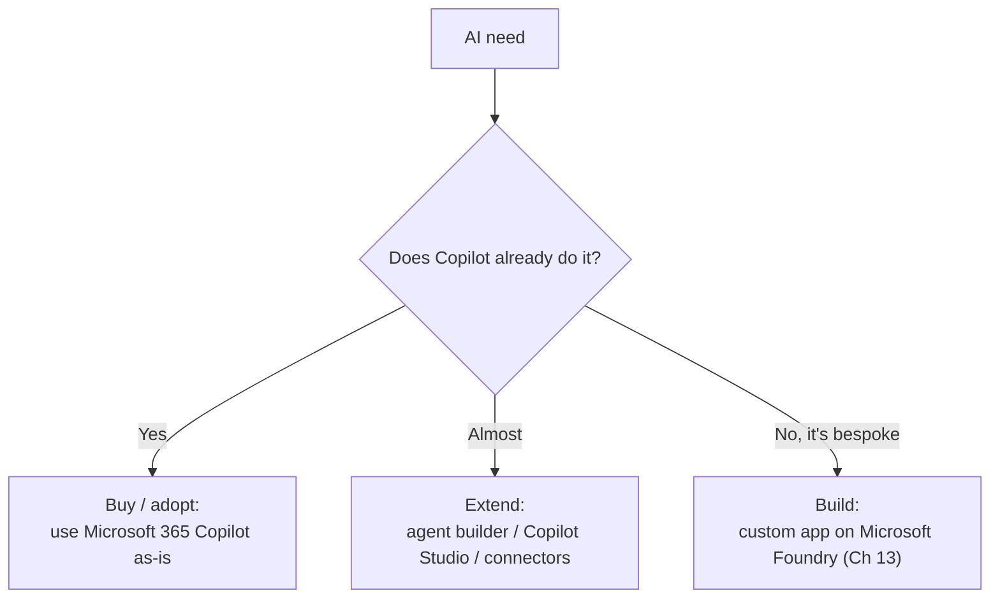

<!-- markdownlint-disable MD041 -->
# Chapter 12 — Extending Copilot

*Part III — AB-731 track: Leading AI Transformation*

---

## In 30 seconds

- **The core idea**: when out-of-the-box Copilot isn't enough, you **extend** it — build custom agents in
  **Copilot Studio**, connect data through **Microsoft Graph** (and connectors), and decide whether to
  **build, buy, or extend**.
- **Why it matters**: extensibility and the build/buy/extend decision are explicit AB-731 objectives.
- **The exam angle**: expect questions on Copilot Studio, Microsoft Graph, and the extensibility framework.
- **Remember**: **extend before you build**. Reuse the Copilot foundation whenever you can; build bespoke
  only when necessary.

---

## Exam map

**Exam map — AB-731 · Domain 2: capabilities of Microsoft Copilot Studio, Microsoft Graph, and extensibility**

---

## 1. Key concepts

> 📖 **Definition — Microsoft Copilot Studio**: a low-code platform to build, customize, and manage agents
> and extend Microsoft 365 Copilot — defining topics, connecting data and actions, and publishing across
> channels.

> 📖 **Definition — Microsoft Graph**: the API and data fabric of Microsoft 365. Beyond grounding Copilot
> (Chapter 2), it's how organizations connect data — including **external** data via Microsoft 365 Copilot
> **connectors** — into the Copilot experience.

> 📌 **Key concept**: Copilot Studio is the leader's tool for *scaling* agents beyond what the no-code agent
> builder (Chapter 8) offers — more control, more connectors, more channels.

### The build / buy / extend decision

> 📖 **Definition — Microsoft 365 Copilot extensibility framework**: the set of options — agents, connectors,
> and plugins/actions — for extending Copilot with your organization's data and systems.

> 🎯 **Exam tip**: prefer **buy → extend → build** in that order. Buy/adopt if Copilot already covers it;
> extend (connectors, Copilot Studio) to close a gap; build on Foundry only for truly bespoke needs. This
> mirrors the "simplest solution that fits" principle from Chapter 1.

---

## 2. How it works

- **Connectors** bring external content (a non-Microsoft system, a knowledge base) into Microsoft Graph so
  Copilot can ground on it — honoring permissions via access control lists.
- **Copilot Studio** lets makers build agents with custom topics, connect to hundreds of systems, add
  actions, and publish to channels — with governance and lifecycle management.
- **Plugins/actions** let Copilot *do* things in other systems (create a ticket, look up an order), not just
  read data.

> 🔍 **How it works**: extending Copilot keeps the shared identity, security, and compliance model. You're
> adding *reach* (more data and actions), not bypassing the guardrails.

> 💡 **Tip**: match the tool to the maker. The **no-code agent builder** (Chapter 8) suits business users;
> **Copilot Studio** suits makers/IT who need connectors, actions, and lifecycle control.

---

## 3. In the real world

**Scenario — closing a data gap.** A services firm wants Copilot to answer questions using its
project-management system, which isn't in Microsoft 365. Rather than build a new app (**build**), IT uses a
**connector** to bring that data into Microsoft Graph and **Copilot Studio** to add an agent with an action
that can look up project status. They **extended** Copilot — faster and cheaper than building from scratch,
and governed by the same security model.

---

## 4. Exam tips

> 🎯 **Exam tip**: **Copilot Studio = build/extend agents (low-code)**; **agent builder = no-code, simpler**.
> Know which fits which maker.

> 🎯 **Exam tip**: **connectors** bring *external data into Microsoft Graph*; that's the usual answer to
> "how do we let Copilot use our non-Microsoft system's data?"

> 🎯 **Exam tip**: default order is **buy → extend → build**. "Build a custom app" is rarely the best first
> answer when extending would do.

---

## 5. Common pitfalls

> ⚠️ **Pitfall**: jumping straight to "build a custom solution" when extending Copilot (connector + Copilot
> Studio) would meet the need faster and cheaper.

- **Confusing agent builder with Copilot Studio**: no-code simple agents vs low-code, connector-rich agents.
- **Forgetting connectors honor permissions**: external data brought into Graph still respects access
  controls.
- **Assuming extending bypasses governance**: it inherits the same security/compliance model.

---

## 6. Practice questions

**1.** An organization wants Copilot to answer using data from a non-Microsoft CRM. What's the most
appropriate approach?

- A. Build a brand-new AI application from scratch
- B. Use a Microsoft 365 Copilot connector to bring the CRM data into Microsoft Graph
- C. Copy the CRM data into everyone's email
- D. Fine-tune a foundation model on the CRM

Answer

**Correct: B.** Connectors bring external data into Microsoft Graph for grounding, respecting permissions.
A over-builds; C is insecure and unhelpful; D is unnecessary and out of scope.

**2.** Which tool best fits a maker/IT team that needs to build an agent with custom actions and connectors
to many systems?

- A. The no-code agent builder
- B. Microsoft Copilot Studio
- C. Excel
- D. Outlook

Answer

**Correct: B.** Copilot Studio is the low-code platform for connector-rich, action-capable agents. The agent
builder is simpler/no-code; Excel and Outlook are productivity apps.

**3.** What is the recommended default order for meeting an AI need?

- A. Build, then extend, then buy
- B. Buy/adopt, then extend, then build
- C. Always build custom
- D. Never extend

Answer

**Correct: B.** Adopt Copilot if it fits, extend to close gaps, and build only for bespoke needs. A reverses
the order; C and D ignore cost/effort.

---

## Further reading

- **Chapter 8 — Building and Using Agents**: the no-code agent builder (the simpler end of extensibility).
- **Chapter 13 — Microsoft Foundry & Foundry Tools**: the "build" option for bespoke solutions.
- **Chapter 14 — Building the Business Case**: the economics behind build/buy/extend.

> 🔗 **Source**: [Microsoft Copilot Studio documentation (Microsoft Learn)](https://learn.microsoft.com/microsoft-copilot-studio/)

> 🔗 **Source**: [Microsoft 365 Copilot extensibility overview (Microsoft Learn)](https://learn.microsoft.com/microsoft-365/copilot/extensibility/)

> 🔗 **Source**: [Microsoft Graph overview (Microsoft Learn)](https://learn.microsoft.com/graph/overview)
