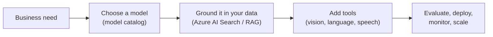

<!-- markdownlint-disable MD041 -->
# Chapter 13 — Microsoft Foundry & Foundry Tools

*Part III — AB-731 track: Leading AI Transformation*

---

## In 30 seconds

- **The core idea**: **Microsoft Foundry** is the platform for building and running *custom* AI solutions,
  and **Foundry Tools** provide the building blocks (models, search, vision). A leader maps use cases to
  these tools and **matches a model to the business need**.
- **Why it matters**: Foundry Tools are an explicit AB-731 objective.
- **The exam angle**: expect questions on Foundry Tools capabilities, matching a model to a need, and the
  benefits (scalability, security).
- **Remember**: Microsoft 365 Copilot is *ready-made*; **Foundry is build-your-own** for scenarios Copilot
  doesn't cover.

---

## Exam map

**Exam map — AB-731 · Domain 2: Identify benefits and capabilities of Foundry Tools**

---

## 1. Key concepts

> 📖 **Definition — Microsoft Foundry** (Azure AI Foundry): Microsoft's platform for designing, customizing,
> and managing custom AI applications and agents — including access to a catalog of models and the tools to
> ground, evaluate, deploy, and monitor them.

> 📖 **Definition — Foundry Tools**: the capabilities within Foundry for building AI solutions, including
> the **model catalog**, **Azure AI Search** (for grounding/RAG), and vision (**Azure AI Vision in Foundry
> Tools**), among others.

| Foundry Tool | What it does | Example use |
| --- | --- | --- |
| **Model catalog** | Choose from many pretrained models | Pick a model sized to the task and budget |
| **Azure AI Search** | Retrieval/grounding (RAG) over your data | Ground a custom app in your knowledge base |
| **Azure AI Vision** | Image understanding | Read text from scanned invoices |
| **Azure AI (language, speech, etc.)** | Language, speech, translation | Transcribe and analyze calls |

> 📌 **Key concept**: Foundry is where the **build** option (Chapter 12) lives. It's for custom, often
> customer-facing or specialized AI — not for the everyday productivity that Microsoft 365 Copilot already
> delivers.

### Matching a model to a business need

Models differ in capability, cost, speed, and modality (text, image, audio). Choosing well means balancing
these against the need.

> 🎯 **Exam tip**: "match an AI model to a business need" rewards **fit, not maximalism**. Pick the model
> that meets the requirement (quality, latency, modality) at acceptable cost — not simply the biggest or
> newest. This echoes token/cost thinking from Chapter 1.

---

## 2. How it works

> 🔍 **How it works**: Foundry provides the full lifecycle (Chapter 1) for a custom solution — select,
> ground, evaluate, deploy, monitor — with enterprise **scalability** and **security** built in.

> 🎯 **Exam tip**: Foundry's headline benefits are **scalability** and **security** — enterprise-grade
> infrastructure, governance, and the ability to grow from pilot to production.

---

## 3. In the real world

**Scenario — beyond Copilot.** A logistics company wants an AI service that reads scanned delivery notes and
answers customer questions from its private shipment database — a customer-facing, specialized need that
Microsoft 365 Copilot isn't built for. The team uses **Microsoft Foundry**: **Azure AI Vision** to extract
text from the scans, a right-sized **model** from the catalog, and **Azure AI Search** to ground answers in
the shipment data. They evaluate, deploy, and scale it on Foundry's secure infrastructure. This is the
**build** path — chosen only because no ready-made Copilot capability fit.

---

## 4. Exam tips

> 🎯 **Exam tip**: Microsoft 365 Copilot vs Foundry — **ready-made productivity** vs **custom-built AI**. If
> a scenario is bespoke or customer-facing, think Foundry; if it's employee productivity, think Copilot.

> 🎯 **Exam tip**: **Azure AI Search** is the grounding/RAG tool for custom apps — the Foundry counterpart
> to Copilot's semantic index.

> 🎯 **Exam tip**: choose a model by **fit** (quality, cost, latency, modality), not by size.

---

## 5. Common pitfalls

> ⚠️ **Pitfall**: using Foundry to build what Microsoft 365 Copilot already does. Build custom only when
> ready-made doesn't fit (Chapter 12's build/buy/extend).

- **Picking the biggest model by default**: match to the need and budget.
- **Skipping grounding**: a custom app still needs RAG (Azure AI Search) to answer from your data.
- **Ignoring the lifecycle**: custom solutions need evaluation and monitoring, not just deployment.

---

## 6. Practice questions

**1.** A company needs a customer-facing AI app that extracts text from scanned documents and answers from a
private database. Which platform fits?

- A. Microsoft 365 Copilot as-is
- B. Microsoft Foundry with Foundry Tools (vision + model + Azure AI Search)
- C. Outlook
- D. A saved prompt

Answer

**Correct: B.** A bespoke, customer-facing solution is the *build* path on Foundry, using vision, a chosen
model, and Azure AI Search for grounding. Microsoft 365 Copilot is for employee productivity, not custom
apps; C and D don't fit.

**2.** Which Foundry tool provides retrieval/grounding (RAG) over your data for a custom app?

- A. Azure AI Vision
- B. Azure AI Search
- C. PowerPoint
- D. Copilot Pages

Answer

**Correct: B.** Azure AI Search provides retrieval/grounding. Vision handles images; the others are
unrelated.

**3.** How should a leader match a model to a business need?

- A. Always choose the largest, newest model
- B. Choose the model that meets the requirements (quality, latency, modality) at acceptable cost
- C. Choose the cheapest regardless of quality
- D. Let the model choose itself

Answer

**Correct: B.** Fit-for-purpose beats maximalism and beats blind cost-cutting. A over-spends; C risks
quality; D isn't how it works.

**4.** What are the headline benefits of Microsoft Foundry?

- A. Scalability and security
- B. Free unlimited usage
- C. No need for responsible AI
- D. It replaces Microsoft 365 Copilot for all tasks

Answer

**Correct: A.** Foundry offers enterprise scalability and security. B is false (it's consumption-based); C is
wrong (responsible AI always applies); D is false — Foundry is for custom builds, not everyday productivity.

---

## Further reading

- **Chapter 1 — Understanding Generative AI**: model types, tokens, cost, and the ML lifecycle.
- **Chapter 12 — Extending Copilot**: build vs buy vs extend — where Foundry is the "build" option.
- **Chapter 14 — Building the Business Case**: Foundry Tools subscription/consumption models.

> 🔗 **Source**: [Azure AI Foundry documentation (Microsoft Learn)](https://learn.microsoft.com/azure/ai-foundry/)

> 🔗 **Source**: [What is Azure AI Search? (Microsoft Learn)](https://learn.microsoft.com/azure/search/search-what-is-azure-search)

> 🔗 **Source**: [Azure AI Vision documentation (Microsoft Learn)](https://learn.microsoft.com/azure/ai-services/computer-vision/)
