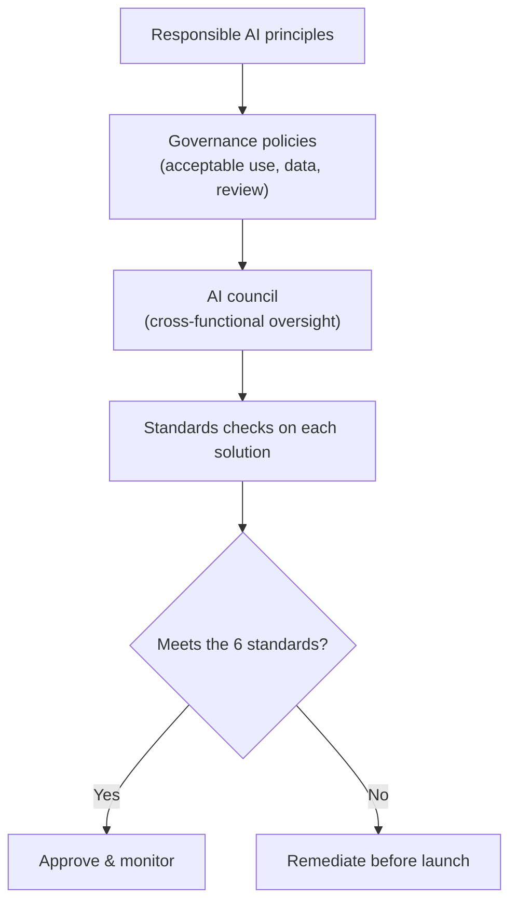

<!-- markdownlint-disable MD041 -->
# Chapter 15 — Governance & Responsible AI Strategy

*Part III — AB-731 track: Leading AI Transformation*

---

## In 30 seconds

- **The core idea**: at organizational scale, responsible AI becomes **governance** — clear principles, an
  **AI council** for oversight and cross-functional alignment, and a way to ensure every solution meets the
  responsible-AI **standards**.
- **Why it matters**: aligning strategy with responsible AI is an explicit AB-731 objective (Domain 3).
- **The exam angle**: expect questions on governance principles, the purpose of an AI council, and the six
  responsible-AI standards applied at scale.
- **Remember**: Chapter 4 was *personal* responsible AI; this chapter is *organizational* — the same
  principles, now governed.

---

## Exam map

**Exam map — AB-731 · Domain 3: Align an AI strategy with Microsoft responsible AI policies**

---

## 1. Key concepts

> 📌 **Key concept**: responsible AI at scale is a *leadership* responsibility. Individuals verifying output
> (Chapter 4) isn't enough — the organization needs **governance**: principles, ownership, and review.

> 📖 **Definition — AI governance**: the framework of principles, policies, roles, and processes that guides
> how an organization adopts and oversees AI responsibly.

> 📖 **Definition — AI council**: a cross-functional body (business, IT, security, legal, HR, compliance)
> that guides AI strategy, provides oversight, and aligns AI use across the organization.

### Why an AI council

AI touches security, privacy, legal, HR, and every business unit. A council brings those voices together so
decisions aren't made in silos.

> 🎯 **Exam tip**: the AI council's purpose is **strategy, oversight, and cross-functional alignment** —
> not day-to-day tool support. If a question asks "who guides responsible AI strategy across the org?", the
> answer is the AI council.

---

## 2. How it works

### Ensuring solutions meet the standards

Every solution is checked against the six responsible-AI standards (Chapter 4): **fairness, reliability &
safety, privacy & security, inclusiveness, transparency, accountability**. Governance operationalizes them —
turning principles into review gates.

> 🔍 **How it works**: governance sets the rules once, the council owns them, and each solution is reviewed
> against the standards before and after launch — with monitoring, because models and data drift (Chapter 1).

> 💡 **Tip**: pair governance with **enablement**. Rules alone slow people down; clear guardrails *plus*
> approved tools and training let people move fast safely (a bridge to Chapter 16).

---

## 3. In the real world

**Scenario — from principle to gate.** A bank wants to adopt AI broadly but fears bias and data leakage. It
stands up an **AI council** with leaders from business, IT, security, legal, and compliance. The council
sets **governance principles** (approved tools only, no sensitive data in ungoverned apps, human review for
customer-facing output) and a **review gate** that checks each use case against the six standards. A
proposed lending-support model is flagged for **fairness** review before launch and adjusted. Governance
turned a principle into a decision.

---

## 4. Exam tips

> 🎯 **Exam tip**: AI council = **cross-functional strategy, oversight, and alignment**. Remember the word
> *cross-functional*.

> 🎯 **Exam tip**: the six standards from Chapter 4 reappear here as *organizational* requirements — be
> ready to apply them to a governance scenario.

> 🎯 **Exam tip**: good governance **enables** safe adoption; "ban all AI" is not responsible-AI strategy.

---

## 5. Common pitfalls

> ⚠️ **Pitfall**: treating responsible AI as purely individual. At scale it requires governance, ownership,
> and review — not just good intentions.

- **No cross-functional body**: without an AI council, decisions fragment and risks slip through.
- **Governance without enablement**: rules with no approved tools/training drive shadow AI use.
- **One-time review**: standards must be monitored over time, not checked once at launch.
- **Blaming the tool**: accountability stays with the organization (Chapter 4).

---

## 6. Practice questions

**1.** Which body is responsible for guiding AI strategy, oversight, and cross-functional alignment?

- A. The help desk
- B. An AI council
- C. A single power user
- D. The vendor

Answer

**Correct: B.** An AI council brings cross-functional leaders together to guide strategy and oversight. The
help desk handles support; one user or the vendor can't own org-wide governance.

**2.** A company wants to adopt AI responsibly at scale. What is the best first step?

- A. Ban all AI tools
- B. Establish governance principles and an AI council to oversee responsible use
- C. Let each employee decide alone
- D. Buy the most expensive product

Answer

**Correct: B.** Governance principles plus a cross-functional council enable safe, aligned adoption. A
forfeits value; C fragments risk; D doesn't address responsibility.

**3.** Ensuring an AI solution meets responsible-AI standards means checking it against which set?

- A. Fairness, reliability & safety, privacy & security, inclusiveness, transparency, accountability
- B. Speed, color, size, price
- C. CPU, memory, disk, network
- D. Tokens, weights, layers, epochs

Answer

**Correct: A.** Those are Microsoft's six responsible-AI principles/standards. The others are unrelated
technical or commercial attributes.

**4.** Why should governance be paired with enablement (approved tools and training)?

- A. To slow adoption deliberately
- B. Because rules without approved tools push people toward ungoverned "shadow AI"
- C. Enablement is unrelated to governance
- D. To avoid ever using AI

Answer

**Correct: B.** Guardrails plus enablement let people move fast safely; rules alone drive shadow use. A and
D defeat the purpose; C is false.

---

## Further reading

- **Chapter 4 — Responsible AI in Practice**: the six principles and personal verification habits.
- **Chapter 16 — Driving AI Adoption**: turning governance into safe, widespread adoption.
- **Chapter 2 — How Microsoft Copilot Works**: the built-in data-protection foundation governance relies on.

> 🔗 **Source**: [Empowering responsible AI practices (Microsoft)](https://www.microsoft.com/ai/responsible-ai)

> 🔗 **Source**: [Microsoft Responsible AI Standard / governance (Microsoft Learn)](https://learn.microsoft.com/azure/cloud-adoption-framework/scenarios/ai/govern)
