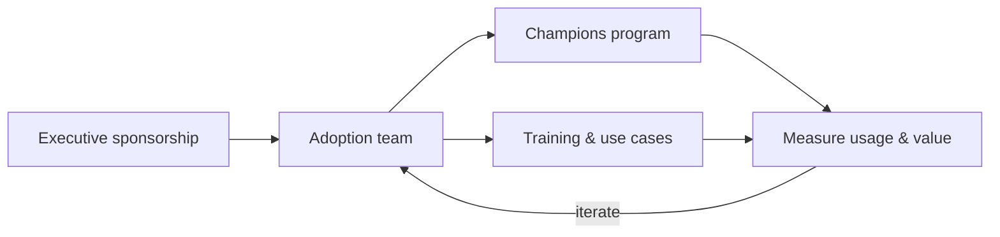

<!-- markdownlint-disable MD041 -->
# Chapter 16 — Driving AI Adoption

*Part III — AB-731 track: Leading AI Transformation*

---

## In 30 seconds

- **The core idea**: adoption is a **program, not an event** — it needs an **adoption team**, an **AI
  champions program**, attention to **barriers**, and awareness of impacts on **data, security, privacy, and
  cost**.
- **Why it matters**: planning for adoption is an explicit AB-731 objective (Domain 3).
- **The exam angle**: expect questions on adoption teams, common barriers, champions programs, and impacts.
- **Remember**: technology delivers value only when people *use it well* — adoption is where ROI is realized
  or lost.

---

## Exam map

**Exam map — AB-731 · Domain 3: Plan for AI adoption across the organization**

---

## 1. Key concepts

> 📌 **Key concept**: the business case (Chapter 14) only pays off if people adopt the tools. Adoption is a
> deliberate **change-management** program, not a switch you flip.

> 📖 **Definition — Adoption team**: a cross-functional team that plans and drives AI rollout — executive
> sponsorship, IT, communications, training, and business-unit representatives.

> 📖 **Definition — AI champions program**: a network of enthusiastic early adopters across teams who model
> good use, share tips, support peers, and feed insights back to the adoption team.

### Common barriers to adoption

| Barrier | Typical cause | Mitigation |
| --- | --- | --- |
| **Lack of awareness/skills** | People don't know what AI can do or how | Training, use-case libraries, champions |
| **Trust / fear** | Worry about accuracy, job impact, "getting it wrong" | Transparency, safe pilots, verification habits |
| **Unclear use cases** | No obvious "why" for daily work | Role-based use cases mapped to real tasks |
| **Data / governance concerns** | Security, privacy, oversharing fears | Governance (Chapter 15), Purview, clear policy |
| **Cost / license confusion** | Unclear value or who gets licenses | Prioritized rollout, measured ROI |

---

## 2. How it works

> 🔍 **How it works**: a sponsor sets the mandate, the adoption team plans and enables, champions spread
> practice peer-to-peer, and usage/value is measured to refine the next wave. It's iterative — like the ML
> lifecycle (Chapter 1), adoption improves through feedback.

### Impacts to plan for

Adoption isn't only cultural — leaders must anticipate impacts on:

- **Data** — more AI use surfaces oversharing and data-quality issues (address with governance/Purview).
- **Security & privacy** — ensure use stays within the governed boundary (Chapters 2, 15).
- **Cost** — licenses and consumption scale with usage; prioritize high-value roles first (Chapter 14).

> 🎯 **Exam tip**: "potential impacts to data, security, privacy, and cost" is stated in the objectives —
> be ready to identify each when planning adoption.

---

## 3. In the real world

**Scenario — a rollout that sticks.** A manufacturer buys 300 Microsoft 365 Copilot licenses. Instead of
just handing them out, an **adoption team** (sponsored by the COO) launches role-based **use cases**
("engineers: summarize specs"; "sales: draft proposals"), recruits an **AI champion** in each department to
coach peers, and runs short training. They watch for **barriers** — addressing a data-oversharing worry with
Purview and clear policy — and **measure usage and hours saved** to justify the next wave. Adoption, not
procurement, delivered the ROI.

---

## 4. Exam tips

> 🎯 **Exam tip**: a **champions program** = peer advocates who model and spread good use. If a question asks
> how to build grassroots momentum, it's champions.

> 🎯 **Exam tip**: adoption needs **executive sponsorship + an adoption team + champions + training**, and
> **measurement** to prove value. Missing sponsorship is a classic failure cause.

> 🎯 **Exam tip**: know the four impact areas to plan for — **data, security, privacy, cost**.

---

## 5. Common pitfalls

> ⚠️ **Pitfall**: "buy the licenses and they'll figure it out." Without enablement and champions, usage — and
> ROI — stalls.

- **No executive sponsor**: adoption efforts without a mandate lose momentum.
- **Ignoring barriers**: unaddressed trust or skills gaps quietly kill adoption.
- **No measurement**: without usage/value metrics you can't justify or steer the rollout.
- **Governance as an afterthought**: adoption surfaces data/security issues — plan for them (Chapter 15).

---

## 6. Practice questions

**1.** An organization bought Copilot licenses but usage is low after three months. What is the most likely
missing ingredient?

- A. More expensive licenses
- B. A structured adoption program — sponsorship, training, champions, and use cases
- C. A faster internet connection
- D. Disabling the tool

Answer

**Correct: B.** Low adoption usually reflects missing change management — sponsorship, enablement, champions,
and relevant use cases. A, C, and D don't address the human adoption gap.

**2.** What is the role of an AI champions program?

- A. To replace the IT department
- B. A network of peer advocates who model good use, coach colleagues, and share feedback
- C. To write the AI models
- D. To approve budgets

Answer

**Correct: B.** Champions drive grassroots, peer-to-peer adoption. They don't replace IT, build models, or
own budgets.

**3.** Which four impact areas should a leader plan for when adopting AI broadly?

- A. Data, security, privacy, and cost
- B. Fonts, colors, themes, icons
- C. CPU, memory, disk, network
- D. Tokens, weights, layers, epochs

Answer

**Correct: A.** The objectives name data, security, privacy, and cost. The others are unrelated technical or
cosmetic attributes.

**4.** Which factor most strengthens an adoption program?

- A. No executive involvement
- B. Visible executive sponsorship plus measurement of usage and value
- C. Keeping the rollout secret
- D. Avoiding any training

Answer

**Correct: B.** Sponsorship signals priority and measurement proves value and guides iteration. A, C, and D
all undermine adoption.

---

## Further reading

- **Chapter 14 — Building the Business Case**: adoption cost and prioritizing high-value roles.
- **Chapter 15 — Governance & Responsible AI Strategy**: the guardrails adoption depends on.
- **Chapter 4 — Responsible AI in Practice**: verification habits champions should model.

> 🔗 **Source**: [Microsoft 365 Copilot adoption resources (Microsoft Learn / Adoption)](https://learn.microsoft.com/copilot/microsoft-365/copilot-adoption)

> 🔗 **Source**: [AI adoption in the Cloud Adoption Framework (Microsoft Learn)](https://learn.microsoft.com/azure/cloud-adoption-framework/scenarios/ai/)
