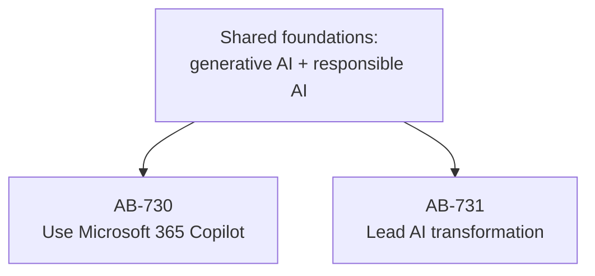

<!-- markdownlint-disable MD041 -->
# Introduction

Microsoft has introduced two certifications for the people who will define how organizations actually use
artificial intelligence — not the engineers who build models, but the professionals who put AI to work and
the leaders who guide its adoption. This book prepares you for both:

- **AB-730 — AI Business Professional**: for the hands-on user who wants to get more done with Microsoft 365
  Copilot and agents.
- **AB-731 — AI Transformation Leader**: for the decision-maker who evaluates, plans, and leads AI adoption
  across teams and functions.

Neither exam asks you to write a single line of code. Both ask you to *understand* — how generative AI works,
what Microsoft's AI portfolio offers, how to use it responsibly, and how to turn it into business value.

## Who this book is for

You use Microsoft 365 every day, you are curious about AI, and you want a credential that proves your
fluency — or you are responsible for bringing AI to your organization and need the strategic vocabulary and
judgment to do it well. If either describes you, this book is written for you. No development background is
assumed.

## How the two exams relate

The two certifications share a foundation and then diverge:

Rather than repeat the common ground twice, this book teaches it **once** in Part I, then gives each exam its
own dedicated track. Every exam objective is mapped to a chapter — see Annex C for the full traceability.

## How this book is organized

- **Part I — Generative AI & Responsible AI foundations** (shared): what generative AI is, how Microsoft
  Copilot works, prompting, and responsible AI.
- **Part II — AB-730 track**: the Copilot experience across Microsoft 365, prompts, conversations, agents,
  drafting and analyzing content, meetings and Copilot Pages.
- **Part III — AB-731 track**: the Microsoft AI portfolio, extending Copilot, Microsoft Foundry, the business
  case, governance, and adoption.
- **Part IV — Exam readiness**: objective checklists, high-yield facts, and a full mock exam for each
  certification.

## How to use this book

Each chapter opens with **"In 30 seconds"** and an **exam map** telling you exactly which objectives it
covers. Along the way you will find callouts: 📌 key concepts, 🔍 how it works, 🎯 exam tips, ⚠️ pitfalls,
💡 tips, 📖 definitions, and 🔗 sources that link back to the official Microsoft documentation. Every chapter
ends with **practice questions**; each track ends with a **mock exam** of roughly 40–50 questions.

> 💡 **Tip**: read for understanding first, then use the exam maps, checklists, and practice questions to
> confirm you are exam-ready. If you can explain a concept in your own words *and* pick the right answer,
> you know it.

## A 4-week study plan

A steady, four-week rhythm works well for most readers. Adjust to your pace.

| Week | Focus | Chapters | Goal |
| --- | --- | --- | --- |
| **1** | Foundations (both exams) | Part I (1–4) | Understand generative AI, how Copilot works, prompting, responsible AI. Do all practice questions. |
| **2** | AB-730 track | Part II (5–10) | Master Copilot usage: prompts, conversations, agents, content, meetings. |
| **3** | AB-731 track | Part III (11–16) | Master the portfolio, Foundry, business case, governance, adoption. |
| **4** | Exam readiness | Part IV (17–18) + annexes | Take both mock exams, review weak areas, skim the glossary and product reference. |

> 🎯 **Exam tip**: a passing score is **700** on each exam. Both target the skills measured **as of
> July 22, 2026**. Before you book, open the official study guide and confirm the objectives haven't changed
> and which features are now generally available.

## A note on accuracy

AI products evolve quickly, and features move between Preview and general availability. This book is grounded
in official Microsoft Learn documentation and flags where things are likely to change. When in doubt, the
live study guide and product documentation are the final word — and the 🔗 sources throughout point you there.

Let's begin.
